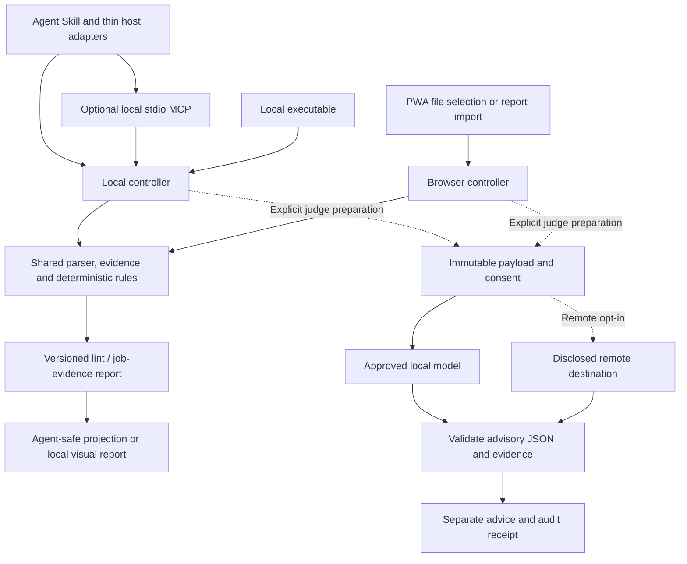

# CV Linter: Product, Architecture, and Implementation Plan

**Date:** 6 September 2026
**Status:** Revised planning proposal; documentation only. No application implementation or empirical CV Linter results are claimed.
**Companion specifications:** [Agent Skill architecture](agent-skill-architecture.md) · [Agent and PWA UX](ui-design.md)

## 1. Product decision and claims policy

**Recommend a distributable Agent Skills-compatible package with a deterministic local executable, first-class advisory LLM judging, and a shared PWA for visual inspection.** A local stdio MCP server and thin Hermes, Claude Code, and Codex adapters expose the same engine. The owner is considering this direction; it is an architectural recommendation, not a validated market conclusion.

The promise remains: understand how software reads your CV, identify possible information loss, and verify your fixes. Default `lint` parses and runs deterministic rules only. `judge` is a supported, visible, explicit operation from the initial release scope, with local inference preferred. Installing the skill, selecting an ATS profile, running lint, or configuring a model never authorizes a judge run. Remote inference requires opt-in provider configuration **and approval of the specific payload and destination**. No local failure may trigger a remote fallback.

This revises the earlier browser-first, rules-only-beta plan. Judge capability is included by default in the product and command contract; judge execution is never automatic. A release may mark an unevaluated model/task experimental or unavailable without hiding the judge workflow or moving its contract to an unspecified future phase.

### Evidence and claims policy

This policy governs all three planning documents, future rule packs, reports, adapter descriptions, UI copy, and benchmark publications.

| Claim class | Required treatment |
|---|---|
| **Vendor/platform fact** | Attribute to a primary source and its particular product, edition, API/workflow, configuration, and documentation date/version where available. Documentation describes a capability, not measured behavior in the user's employer tenant. |
| **Research finding** | Name the paper and evaluation setting. Chatbot preference agreement, benchmark errors, and hiring audit disparities are findings in those studies, not CV Linter results. |
| **Design inference / decision** | Identify our interpretation or proposed behavior. A cited vendor limitation can motivate a risk check without proving that every instance of a layout causes failure. Unless explicitly labeled otherwise, architecture, contracts, and UX requirements in these documents are design decisions. |
| **Unvalidated assumption / target** | Label weights, budgets, dataset sizes, timing, hardware feasibility, demand, and acceptance targets as proposals until measured. |
| **CV Linter measurement** | Require a dated, versioned experiment, authorized dataset, sample counts, methodology, configuration, and uncertainty. None exists in this planning revision. |

Allowed wording: “Native text was detected,” “This source documents a parsing risk,” and “No evidence was located in the assessed passages.” Prohibited wording: “ATS certified,” universal pass rates, hiring/rejection probability, invented qualification verification, or an LLM opinion presented as a deterministic finding. Neither successful attachment nor a parser error establishes a hiring outcome. Absence of a rejection rule in reviewed documentation is not proof that such a workflow cannot be configured.

Keep **file acceptance, parsing, structured fields, search visibility, employer screening, and ranking** distinct. Local parsing/rules are authoritative for CV Linter's observations and rubric, not authoritative about an external ATS or the truth of a person's qualifications. Dates, exact terms, and credentials are document evidence; missing text does not prove missing ability. Do not infer work authorization, protected characteristics, or eligibility from names or proxies.

### Research provenance and corrections

Read and preserve the Luna memos as research inputs:

- [Distribution research](research/agent-skill-distribution-research.json): Agent Skills, executable, MCP, host adapters, and PWA tradeoffs.
- [Judge research](research/llm-judge-research.json): bounded tasks, validity limits, bias, injection, and local inference.
- [ATS vendor research](research/ats-vendor-research.json): seven vendor profiles and their primary citations.

The memos are unchanged. Their recommendations are not automatically accepted requirements. In particular, “judge disabled by default” is interpreted as **no implicit execution**, following the owner's requirement for first-class judge support. Recruiter-side pairwise candidate selection, eligibility filters, automatic rewriting, and application submission are outside this product's scope.

Source checks on 6 September 2026 revisited Agent Skills, host documentation, MCP tools, key vendor pages, and judge papers. This was a selective documentation check, not exhaustive recertification or tenant testing. Some Lever pages could not be fetched and Ashby content was not exposed by the text reader; retain those claims as **memo-attributed, pending source recheck**. iCIMS' accented-email limitation is also memo-attributed pending confirmation. Do not invent publication or last-verification dates for inherited claims. Workday and Taleo refinements below identify information found in the primary pages beyond the memo summary.

## 2. Audience, scope, and authority

**Audience assumption:** Individual job seekers using agent-assisted workflows are the initial distribution audience; people without an agent and users needing layout inspection use the PWA. Validate this preference in interviews. Include graduates, career changers, and varied employment histories without requiring a degree, summary, phone, street address, or conventional chronology.

Core tasks are to lint one explicitly selected CV, inspect extraction and evidence, request bounded advice when useful, compare the CV with a supplied job description, and verify a revised artifact. Support text-bearing PDF, DOCX, and plain text initially, with English semantic coverage declared explicitly. Unsupported language or unreadable input produces unknown outcomes or abstention.

The product does not submit applications, rank applicants, decide hire/reject, verify qualifications, edit the original CV automatically, or generate credentials and metrics. Career gaps, identity, school/employer prestige, page count, fonts, and stylistic preferences are not compatibility defects. Research donation, export, model download, host-context disclosure, and remote judging are separate user actions.

Measure success through verified correction of important defects, evidence comprehension, successful agent task completion, and useful grounded advice. Do not optimize for a higher internal score or persuasive model prose.

| Operation | Authority and default behavior |
|---|---|
| `lint` | Deterministic parsing, rules, scoped vendor guidance, and evidence; no model initialization, model download, network request, or judge flag. |
| `compare-to-job` | Deterministic requirement inventory and literal/versioned-vocabulary evidence retrieval. Required/preferred interpretations remain reviewable; no implicit embeddings or generative judging. |
| `judge` | Explicit, criterion-level advisory review over an immutable evidence snapshot; local preferred, remote opt-in; validated output and audit receipt required. |
| `report` | Deterministic rendering/export or revision diff of existing reports. Never re-judges or re-lints behind a render action. |

A generic request such as “check my CV” selects lint. A request for semantic advice selects the judge preparation flow and its model/payload disclosure. The host's conversational model is not automatically the CV Linter judge. Full command and MCP contracts are specified in the [skill architecture](agent-skill-architecture.md#3-command-and-api-contracts).

## 3. ATS evidence and vendor-specific implications

All profiles begin as **documentation-based guidance**. A named vendor is not enough to activate every published constraint: record the edition, application or API path, configuration assumptions, source provenance, and profile version. Unknown scope produces a caution or `unknown`, not a hard universal failure. Local operational limits are independent of vendor limits.

| Vendor | Vendor facts and scope | Design inference and limits |
|---|---|---|
| **Greenhouse** | Candidate uploads document DOC/DOCX, PDF, RTF, TXT and a 100 MB upload limit. Resume parsing has a distinct 2.5 MB limit and documents image, column, table, header/footer, text-box, unclear-section and split-letter risks; manual correction follows failed parsing. [Uploads](https://support.greenhouse.io/hc/en-us/articles/360052218132-Supported-formats-for-resumes-cover-letters-and-other-candidate-uploads), [parse failures](https://support.greenhouse.io/hc/en-us/articles/200989175-Unsuccessful-resume-parse). | Separate upload and parse profiles; a 3 MB text PDF may fit the documented upload budget but exceed the parsing budget. Layout observations justify scoped cautions, not automatic rejection predictions. Plausible synthetic identities are needed in authorized parser experiments because obvious placeholders can affect extraction. |
| **Lever** | The memo attributes parsing support for Word/DOCX, PDF, RTF, WordPerfect, HTML/MS Office HTML, and ODF, but not JPG/PNG, with profile-field population. Resume-only search differs from broader search of parseable attachments, notes, and feedback. [Parsing](https://help.lever.co/hc/en-us/articles/20087345054749-Understanding-resume-parsing), [Resume search](https://help.lever.co/hc/en-us/articles/20087317030685-Searching-the-Database-for-Candidates), [advanced search](https://help.lever.co/hc/en-us/articles/20087212721309-Using-advanced-search-and-rediscovery). The API distinguishes image attachment from parsing. [API](https://hire.lever.co/developer/documentation). | Check native-text availability and whether terms survive extraction. Do not claim a term elsewhere in a profile is present in resume-only search. Our initial three formats need not expand to every format Lever supports. Search correspondence still needs authorized tests. |
| **Workday Recruiting** | The admin guide documents prospect/application creation through parsing. The checked page says hidden fields, Languages, and Skills are not auto-filled in this workflow, and format/word order can affect results; it advises avoiding images/image-based styles. [Resume parsing](https://doc.workday.com/admin-guide/en-us/human-capital-management/recruiting/candidates/set-up-prospects-and-candidates/hdc1552497830785.html). Marketing discusses extraction and ranking/filtering capabilities. [ATS overview](https://www.workday.com/en-us/topics/hr/applicant-tracking-system.html), [software overview](https://www.workday.com/en-us/topics/hr/applicant-tracking-software.html). | Refine the memo's “no detailed layout failure modes” statement with the admin guidance, while keeping extension/size matrices and employer ranking unknown. Do not infer Skills-field autofill from broad marketing. Use conservative text/image warnings and user-supplied tenant requirements. |
| **Ashby** | The memo attributes profile autofill and full-text resume search, including exact word/phrase, equality, related words, Boolean operators, prefix wildcards and grouping. General application file uploads include documents, images and videos up to 50 MB; archive/reject is a workflow action. [Profile](https://docs.ashbyhq.com/candidate-profile), [search](https://docs.ashbyhq.com/candidate-search), [files](https://docs.ashbyhq.com/candidate-files-and-file-categories). | Label these as memo-attributed pending direct recheck. The general 50 MB attachment allowance is not a resume-parser limit or evidence of image parsing. Inspect text/phrase visibility locally; validate actual search modes separately. |
| **iCIMS** | Candidate guidance describes upload-assisted profile entry and configurable portals, required fields, and screening steps. The memo also attributes searchable profile/workflow fields and imperfect migration parsing. [Candidate guide](https://community.icims.com/articles/HowTo/Candidate-Guide-to-the-iCIMS-Talent-Platform), [search FAQ](https://community.icims.com/articles/FAQ/Searching-Reporting-FAQ), [migration document](https://community.icims.com/servlet/servlet.FileDownload?file=0151L00000Schpu). | No universal format or size contract is established by the reviewed material. Offer an employer-specific checklist and field verification, without requiring users to disclose screening/EEO answers. Keep the memo's accented-email limitation as unscored guidance pending source recheck; never transliterate a person's name or address automatically. |
| **SmartRecruiters** | The resume-parse API exposes contact, location, web-profile, education and experience fields and `UNPARSABLE_RESUME`/`INCOMPLETE_RESUME` errors, including image input failures. [Parse API](https://developers.smartrecruiters.com/reference/candidatesresumeparse). The application API documents Base64 attachments of 2 MB per file, PDF/DOC(X)/RTF/JPG/PNG, configured screening questions and 4 kB text/textarea answers. [Application API](https://developers.smartrecruiters.com/docs/post-an-application), [add-to-job API](https://developers.smartrecruiters.com/reference/candidatesresumeaddtojob-1). | Hard validation applies only to the selected API/workflow with known units/encoding semantics, not every SmartRecruiters portal. Distinguish attachment acceptance, parser errors, and application validation. Required contact/answer checks require a supplied contract; never turn optional omissions into generic CV defects. New status or parse errors do not predict selection. |
| **Oracle Taleo Enterprise** | Enterprise 21B documents resume text/attachment search, Conceptual Search and legacy keyword search over the last three supported attachments versus optimal keyword search over all supported attachments, and 100 KB parsing workflows. Candidate creation guidance also mentions administrator-defined size and format. [21B candidate management](https://docs.oracle.com/en/cloud/saas/taleo-enterprise/21b/otrec/candidate-management.html), [attachments](https://docs.oracle.com/en/cloud/saas/taleo-enterprise/otrcg/c-attachment.html). | Treat 100 KB as a historical/workflow-specific constraint requiring edition/configuration confirmation, never a universal modern upload limit. Attachment recency and search configuration cannot be read from one CV; report them as unassessed context. Conceptual relevance/discovery is not an automatic rejection rule. |

Greenhouse separately documents configured application-question auto-rejection and optional Talent Matching with employer criteria and human review. These capabilities contradict blanket statements that ATS products never score or reject; they do not reveal a universal CV scoring function. [Auto-reject](https://support.greenhouse.io/hc/en-us/articles/360000653472-Auto-reject), [Talent Matching](https://support.greenhouse.io/hc/en-us/articles/41396009937307-Talent-Matching).

### Profile governance

Each future vendor rule records `claim_kind`, source URL/title, source section, edition/workflow, publication date if known, `last_verified_at` (nullable), `verification_status`, configuration prerequisites, unit semantics, rule version, and benchmark status. Do not convert ambiguous MB/KB or pre-/post-Base64 limits into exact byte rejection thresholds without verifying semantics; near-boundary cases remain cautions until resolved. Updates create new profile versions; analysis never fetches updated sources or changes an existing report's profile silently.

Group rules by acceptance, parsing, fields, search, and application context. Tenant-supplied requirements have separate provenance and do not become vendor facts. Missing tenant access, attachment history, or question definitions means `unknown` or not assessed. A documentation citation supports the rule's motivation; measured downstream effect requires the benchmark in section 10.

### Standards retained as supporting evidence

Tagged PDF can express semantics/reading order when consumers use it; OOXML defines DOCX structure; JSON Resume is an optional structured-export basis. None certifies ATS acceptance. [Tagged PDF](https://pdfa.org/resource/tagged-pdf-q-a/), [ECMA-376](https://ecma-international.org/publications-and-standards/standards/ecma-376/), [JSON Resume](https://jsonresume.org/schema). Target accessibility is [WCAG 2.2 AA](https://www.w3.org/TR/WCAG22/).

## 4. First-class LLM judge with bounded authority

### Responsibility split

| Layer | Owns | Must not do |
|---|---|---|
| Deterministic core | Bytes, parsing/provenance, literal term checks, date arithmetic with explicit ambiguity, rule applicability, vendor constraints, scoring arithmetic, evidence validation | Claim to verify a credential or reproduce an unknown ATS; treat ambiguous extraction as fact |
| Advisory judge | Clarity/readability, vague-claim and accomplishment-evidence critique, source-preserving wording suggestions, semantic skill mapping, criterion-level job evidence explanations | Change native extraction, deterministic labels/scores, thresholds, profile scope, or user claims; rank applicants; infer eligibility or protected traits |
| User | Interpret ambiguous evidence, choose edits, verify employer form fields, accept or dismiss advice | Be presented a hidden model decision as a lint result |

The judge may suggest how to make a STAR-style accomplishment clearer, but cannot invent the situation, actions, result, numbers, or credentials. Semantic mappings must retain original wording and exact evidence. A missing requirement is “not evidenced in this CV,” not “unqualified.” Only compare revisions of the same user's CV for editorial review; the memo's pairwise candidate-selection suggestion is outside scope.

Reject both an LLM-only compatibility authority and weighted averages of rule and LLM scores. A favorable advisory opinion must never hide a parsing defect. Conflicting outputs remain visible in separate sections; unresolved interpretation results in abstention or user review.

### Research implications, not product results

MT-Bench/Chatbot Arena demonstrate task-specific human-preference agreement and position, verbosity, and self-enhancement limitations; this does not establish CV correctness. [Zheng et al.](https://arxiv.org/abs/2306.05685), [memo-linked HTML](https://arxiv.org/html/2306.05685). JudgeBench shows why objective correctness must be evaluated separately from preference alignment. [Tan et al.](https://arxiv.org/abs/2410.12784). G-Eval motivates rubric-based structured evaluation but does not establish bias-free judgments. [Liu et al.](https://arxiv.org/abs/2303.16634).

Position-bias research motivates order reversal and rubric permutations. [Shi et al.](https://arxiv.org/html/2406.07791). Hiring-related studies motivate counterfactual tests and caution about identity proxies; their reported disparities must not be presented as measured CV Linter bias. [Gaebler et al.](https://arxiv.org/html/2404.03086v1), [Shin et al.](https://arxiv.org/html/2503.19182v1).

### Judge protocol and validation

1. Prepare an immutable snapshot of approved CV/JD spans, deterministic report, task and criteria. Record excluded/redacted content, parser uncertainty, token budget and retrieval coverage; never silently truncate.
2. Disclose model/provider, artifact or snapshot identity, runtime, execution location, forwarding status, exact payload, retention implications and costs/limits. Local setup and remote transmission are different approvals.
3. The trusted controller binds consent to that snapshot, destination, model, prompt/rubric, redaction policy, allowed attempts, and expiry. A model-generated `consent=true` is not authorization. A changed payload/model/destination invalidates consent.
4. Execute the judge without tools, filesystem access, browser actions, or authority to perform follow-up requests. The transport can send only the approved payload to the approved destination.
5. Parse one JSON object using the [strict judge schema](agent-skill-architecture.md#5-strict-judge-output-schema), then validate evidence and semantics. Reject unknown fields, duplicate keys/criteria, invalid enums, extra criteria, unverifiable quotes and fabricated spans. Do not recover malformed output with an unbounded repair conversation.
6. Append success, abstention, cancellation, refusal, invalid-output or execution-error events to a controller-owned audit record. Keep the deterministic report intact in every outcome.

Each criterion carries a label (`supported`, `contradicted`, `insufficient_evidence`, or `abstain`), confidence category, exact evidence spans, missing-evidence explanation and concise rationale. Criterion-specific rubrics define what “supported” means; there is no holistic judge score. Confidence is uncalibrated unless a named calibration evaluation exists. Evidence existence is machine-checkable; whether it entails an advisory judgment still needs task validation and human review.

Abstain for unreadable/unsupported inputs, uncertain extraction, missing required context, contradictions, suspected injection, low confidence, or exhausted resources. “Insufficient evidence” may describe only a complete assessed scope; incomplete retrieval or truncation must yield abstention rather than a claim of absence. Job judgments reference both CV evidence (when present) and the exact job requirement. Never promote OCR/model reconstructions to native-text evidence.

### Inference location and model selection

Support local batch inference through a pinned native runtime first, with a selected GGUF model as an experimental candidate. llama.cpp and Hugging Face document local execution and compatible local serving. [llama.cpp](https://github.com/ggml-org/llama.cpp), [local agents](https://huggingface.co/docs/hub/agents-local). Prefer a managed local process with egress denied; a loopback URL alone does not establish local inference. Remote/self-hosted machines still receive data off the user's device.

Compare rules/vocabulary, small local classifiers, small quantized instruction models, larger local candidates if needed, and an explicitly authorized remote reference. Model sizes, Mac feasibility, latency, and memory are unvalidated until benchmarked; do not mandate a 1–2B model based on size alone. Record weights/license/digest, quantization, runtime, context limit, prompt and decoding parameters. No automatic weight download, cloud model substitution, or silent model alias upgrade.

Local capability is preferred, but all enabled model/task combinations need evidence quality, bias, injection, and performance gates. Browser inference is a later runtime option over the same judge contract. If no approved model is installed, show “Judge supported; model setup required” while lint remains available.

## 5. Scoring rubric, validity, and explainability

### Separate three outputs

| Output | What it means | What it does not mean |
|---|---|---|
| Compatibility findings | Observed problems and supported risks in the submitted artifact | A hiring recommendation |
| Compatibility check index | Performance against a named, versioned rubric | Probability of passing an ATS |
| Job evidence coverage | How the CV supports specified job requirements | Qualification verification or an employer’s match score |

Writing advice should remain separate from all three.

### Proposed compatibility rubric

The following weights are provisional:

| Dimension | Weight | Candidate checks |
|---|---:|---|
| Machine-readable text | 40 | Native text presence; suspicious character substitution; duplicated or fragmented extraction; image-only regions |
| Reading order and separation | 25 | Interleaved columns; broken line grouping; repeated furniture mixed into content |
| Section and record association | 25 | Recoverable grouping of titles, organizations, dates, and descriptions; identifiable boundaries |
| Field representation | 10 | Present contact details and dates remain legible and associated with their context |

File corruption, unsupported formats, resource limits, and selected vendor upload constraints are **preflight outcomes**, not small deductions that can be averaged away.

Not every candidate check belongs in the numerical rubric immediately. For example, detecting a DOCX table is straightforward; proving it causes information loss is harder. Initially, such findings may be unscored cautions.

### Critical validity distinction

At runtime, CV Linter generally does not possess ground-truth text for the document. It therefore cannot truthfully claim “we recovered 98% of your CV” merely because extraction completed.

It can report:

- Pages processed.
- Native text detected.
- Specific suspicious regions.
- Disagreement between extraction interpretations.
- What the user can verify in the preview.

**Measured recovery percentages belong in the benchmark**, where ground truth exists.

### Missing evidence must not become a passing score

Each check returns:

- `pass`
- `partial`
- `fail`
- `unknown`
- `not_applicable`

Applicability follows the declared input/profile capabilities. A failed parser or disabled check produces `unknown`, not `not_applicable`.

For applicable checks, let:

- \(w_i\): fixed check weight.
- \(q_i\): result value, initially proposed as 1, 0.5, or 0.
- \(K\): checks with known outcomes.
- \(U\): checks with unknown outcomes.
- \(W\): total applicable weight.

Then:

\[
S_{\min}=100\frac{\sum_{i\in K}w_iq_i}{W}
\]

\[
S_{\max}=100\frac{\sum_{i\in K}w_iq_i+\sum_{i\in U}w_i}{W}
\]

\[
Coverage=100\frac{\sum_{i\in K}w_i}{W}
\]

This interval expresses **unresolved check outcomes**, not statistical confidence or ATS acceptance probability.

Proposed display policy:

- Withhold the aggregate when core extraction fails, meaningful CV content cannot be established, total applicable weight is zero, or coverage is below the provisional 90% target.
- Show a range when sufficient coverage exists but some outcomes remain unknown.
- Show a single index only when every applicable scored check is resolved.
- Let severe findings dominate the headline status regardless of the aggregate.
- Deduplicate related findings and cap their contribution within each dimension.

An empty document must never earn a perfect score. Pasted text cannot inherit passing PDF-layout checks. Scores should be compared only under the same rubric, profile, and compatible input capabilities.

### Explain every finding

Every finding needs:

1. Stable rule ID and rule version.
2. Observation, separate from its possible consequence.
3. Source location and evidence.
4. Severity and basis for confidence.
5. Suggested correction.
6. Score contribution, if any.
7. Source citation or benchmark evidence supporting the rule.

**Illustrative finding**

> **Contact information is stored in a DOCX header**
> Evidence: the email address occurs in the document’s header part.
> Possible consequence: some parsing configurations may miss it.
> Suggested action: place the same visible contact information in the document body and recheck.
> Confidence: high about its location; downstream impact has not been tested for your employer.
> Scoring: caution only in the generic profile; vendor-specific treatment requires documented scope.

Do not impose arbitrary penalties for page count, font brand, color, missing action verbs, or absence of quantified achievements. Never suggest fabricating credentials, metrics, company suffixes, or keywords to satisfy a rule.

## 6. Layered distribution architecture

| Layer | Proposed responsibility | Boundary |
|---|---|---|
| **Agent Skills-compatible core package** | `SKILL.md`, pinned executable helpers, rule/profile data, schemas, references, privacy policy and synthetic fixtures | Portable workflow format; instructions are not a sandbox |
| **Local executable** | `lint`, `compare-to-job`, explicit `judge`, `report`; schema validation and local controller | Primary execution path; no requirement for an agent or server |
| **Optional local stdio MCP server** | Typed wrappers over the same operations and session-scoped resources | No public listener, arbitrary shell, generic filesystem tools, or remote MCP in the initial release |
| **Thin Hermes / Claude Code / Codex adapters** | Discovery, invocation, permission declarations, consent UI integration, safe result presentation | No duplicated parsing/rules/prompts and no host-model judging shortcut |
| **Shared PWA client** | File selection, source highlights, reading-order inspection, consent review, report/audit display | Same core and schemas; browser workers or imported reports, not a second rules engine |

Agent Skills specifies a `SKILL.md` directory with optional scripts, references and assets; host tool allowances are not portable security enforcement. [Specification](https://agentskills.io/specification). Hermes documents skills and local MCP integration. [Skills](https://hermes-agent.nousresearch.com/docs/user-guide/features/skills), [MCP](https://hermes-agent.nousresearch.com/docs/user-guide/features/mcp). Claude supports skill/plugin packaging and its own permission model. [Skills](https://docs.anthropic.com/en/docs/claude-code/skills), [plugins](https://docs.anthropic.com/en/docs/claude-code/plugins), [permissions](https://docs.anthropic.com/en/docs/claude-code/permissions), [security](https://docs.anthropic.com/en/docs/claude-code/security). Codex supports explicit/implicit skill activation with host-configured permissions. [Skills](https://developers.openai.com/codex/skills), [memo URL](https://developers.openai.com/codex/skills.md), [plugin skills](https://developers.openai.com/plugins/concepts/skills), [approvals/security](https://developers.openai.com/codex/agent-approvals-security), [permissions](https://developers.openai.com/codex/permissions).

These are documented host capabilities; actual installation, namespace and permission compatibility must be tested by host version. A plugin is a host-specific release wrapper, not the only distribution. Do not require a plugin to run the portable executable.

The diagram is a logical sharing model, not a single shared runtime process. Browser workers schedule work; they are not security sandboxes. The PWA cannot speak stdio directly. Initially it runs browser-compatible core modules and imports explicitly exported report bundles. Any later authenticated loopback bridge is a separate deployment with pairing, host/origin checks, request limits and forwarding disclosure.

### Shared modules and canonical evidence

Keep parser adapters, normalizer, pure rule engine, schema validators, rubric arithmetic, report builder, and revision comparison independent of UI, persistence, inference transports and host SDKs. Controllers supply only explicit input capabilities, bounded execution and approved output sinks.

Preserve original input hash and native bytes locally, native extraction, normalized text with reversible location mapping, candidate sections/records, warnings and capability flags. Evidence includes PDF page/coordinates/text spans/structure references; DOCX part/paragraph/run/table references; or plain-text line and character offsets. Normalization never discards the original extraction. Mark native, OCR, user-corrected and model-interpreted provenance distinctly.

A report and all evidence IDs belong to immutable content hashes and parser versions. User corrections create an overlay; changing the source artifact creates a new revision and invalidates prior judge preparation. DOCX reconstruction is not Word pagination. A hash verifies identity only against trusted bytes; an imported report can make fabricated claims and must not be treated as authenticated merely because it contains hashes.

### Packaging, permissions and reproducibility

The [package specification](agent-skill-architecture.md#2-package-tree-and-release-contract) defines the tree, manifests and lifecycle. Use SemVer for releases and independently pin parsers, normalizer, rules, profiles, schemas, prompts, rubrics, model/runtime and host adapters. Include dependency locks, artifact SHA-256 checksums, licenses/SBOM, build provenance and signed releases with a published trust key. Integrity checks detect changes; adjacent checksums alone do not authenticate a publisher.

Enforce read access through user-selected files/bytes, not the working directory. Reject directory recursion, path traversal, symlink escapes, arbitrary URLs and document-linked resources. Bind checks to opened file identity to prevent replacement races. Output is restricted to explicit destinations/private run directories; do not edit inputs, scan home directories, inherit broad credentials, install dependencies or update packages during analysis. Declarative rule packs cannot introduce executable plugins.

Record the original input hashes, parser/normalizer versions, capabilities, rules/profile/rubric/schema versions, locale, options and limits, artifact manifest digest, and warnings in every deterministic report. Stable ordering and canonical serialization define a reproducible analysis payload; execution timestamps, elapsed time and run IDs live in a separate envelope. Compare bytes only for identical inputs/options and supported pinned environments. Cross-runtime equivalence is a benchmark target, not an existing guarantee.

Model runs record prompt/model/runtime/quantization/decoding/order seeds and approved payload hashes. These support replay and explanation of changes, not a promise of bit-identical model output or availability of a remote snapshot. Never migrate a historical report silently.

## 7. Parsing constraints and implementation choices

### PDF

**Recommendation:** PDF.js for rendering and native extraction, with a CV-specific interpretation layer. Its APIs expose text content and an optional structure tree. [PDF.js API](https://mozilla.github.io/pdf.js/api/draft/module-pdfjsLib-PDFPageProxy.html)

The adapter should preserve positioned spans and compare plausible reading orders where necessary. Do not treat a simple top-to-bottom coordinate sort as universally correct.

Test explicitly:

- Multi-column and rotated content.
- Ligatures, missing character mappings, and unusual glyph spacing.
- Invisible text and duplicated OCR layers.
- Mixed scanned and native-text pages.
- Headers, footers, annotations, and form content.
- Password-protected or malformed documents.

Use a restricted renderer; do not execute document actions or automatically open embedded links or attachments. Load fonts, character maps, and supporting assets from controlled locations.

For encrypted files, request a password locally and keep it only for the session. Explain unsupported encryption or restrictions rather than presenting an empty report.

### Scans and OCR

The MVP should detect likely image-only pages and explain the limitation.

Later, render selected pages locally and pass those images to Tesseract.js. Tesseract.js runs in the browser but does not directly accept PDF files. [Tesseract.js documentation](https://github.com/naptha/tesseract.js)

OCR-derived text must carry distinct provenance. It can make a document inspectable without proving that the **original submitted PDF** is machine-readable to an ATS.

Do not silently award native-text compatibility points because local OCR recovered the content. Producing a corrected searchable PDF would be a separate, validated feature.

### DOCX

**Recommendation:** Inspect OOXML directly for structural evidence. Use Mammoth as a semantic extraction aid or comparison implementation, not the sole source of layout facts.

Mammoth deliberately simplifies formatting, documents imperfect conversion for complex files, and performs no sanitization. [Mammoth documentation](https://github.com/mwilliamson/mammoth.js)

Inspect:

- Main document, headers, footers, tables, and text boxes.
- Paragraph styles and numbering.
- Hyperlinks and relationships.
- Hidden text, comments, and tracked changes.
- Embedded objects and unsupported content.

Define an explicit revision policy: for example, analyze the intended final view while separately flagging unresolved tracked changes. Do not merge deleted and inserted text into one apparent CV.

DOCX does not provide a dependable page-and-coordinate view without layout rendering. Label its preview **“Reconstructed content”** and locate findings by section or paragraph. Do not claim it reproduces Word’s pagination.

Before extraction, enforce archive entry, decompression, nesting, and processing limits. Reject external entities and never resolve external document relationships.

### Plain text

Accept UTF-8 and BOM-identified UTF-16 initially, plus pasted text. Surface decoding failures and allow an explicit encoding choice if later needed.

Preserve an original view alongside normalization. Handle tabs, bullets, line endings, and Unicode carefully.

Mark graphical layout, embedded-image, and original-file checks as unavailable. Pasting text cannot establish the compatibility of the file from which it was copied.

### Initial support limits

**Proposed operational limits:** 10 MB input, 20 PDF pages, and 50 MB expanded DOCX content, plus separate limits on archive entries, rendered pixels, and elapsed work.

These are application resource budgets, not ATS rules. Tune them using measurements.

Legacy DOC, RTF, image files, and complex embedded objects remain unsupported initially. Provide local conversion guidance.

## 8. Threat, privacy, consent and audit model

Original CVs, job descriptions, filenames, evidence, reports, hashes, embeddings and model responses can all be sensitive. Local execution does not by itself establish privacy: the host may forward tool arguments/results to its conversational model or retain transcripts. A remote agent runtime also means the executable is not running on the user's device.

### Two disclosure boundaries

1. **Agent-host context:** Before returning document-derived content to a cloud/unknown host, disclose the host destination and selected output. Default to opaque local report handles without excerpts, identifiers, hashes or document-specific summaries. The user can inspect the report locally or approve a specific projection for the host. A reduced summary is still data egress. If host behavior cannot honor this boundary, strict local use requires the standalone executable, PWA or a verified local host.
2. **Judge inference:** Independently approve the model, location, forwarding path and exact minimized payload. Host-context permission is not permission for a separate judge provider. Configuring credentials or choosing an ATS is not transmission consent.

A document already pasted into a cloud chat has crossed the host boundary; the skill cannot undo it. State the actual exposure rather than claiming the whole conversation remains on-device. Keep CV text and secrets out of command-line arguments; use explicit files, local handles or bounded standard input. Logs and shell transcripts need the same disclosure analysis.

### Enforced controls

| Threat | Design control |
|---|---|
| Overbroad host or MCP file access | Controller allowlists and host/OS restrictions; scoped input handles, no generic read/search/exec tools |
| Malicious documents | Validate signatures; bound archive entries/decompression/pixels/time/memory; never resolve external entities, relationships, links, fonts or images; cancel isolated parsing work |
| Prompt injection | Treat CV/JD, metadata, hidden text and retrieved spans as data; inspect/flag suspicious imperative or encoded content; record excluded spans; abstain when safety or evidence integrity is uncertain |
| Judge action escalation | No tools, shell, filesystem, browsing, messaging or hiring-system mutations; destination chosen by trusted configuration, never by model output; no automatic follow-up prompts or URLs |
| Fabricated evidence | Strict JSON and reference checks against the approved snapshot; reject invalid replies before display; separate semantic entailment evaluation from exact quote matching |
| Malicious previews/exports | Escape all document/model text; sanitize controlled rendering; reject scripts/unsafe link schemes; no remote assets in reports |
| Dependency/model tampering | Verify signed artifact manifests and digests before reading a CV; approved pinned releases; no download or install-on-demand within lint/judge |
| Accidental telemetry | No third-party analytics, session replay, content-bearing crash reports or automatic CV-derived diagnostics |
| Retention/recreation after deletion | Explicit storage/export policy, cancellation, dependent-record deletion and cross-tab invalidation |

Delimiters and redaction help structure/minimize input but do not solve injection or identity-proxy bias. Flagging or excluding suspicious text must not rewrite native evidence or manufacture a clean lint report. OWASP discusses indirect prompt injection, including file-carried attacks. [Memo-linked guidance](https://owasp.org/www-project-top-10-for-large-language-model-applications/2_0_vulns/LLM01_PromptInjection.html), [current risk page](https://genai.owasp.org/llmrisk/llm01-prompt-injection/). Browser workers and local storage do not guarantee confidentiality. [OWASP browser guidance](https://cheatsheetseries.owasp.org/cheatsheets/HTML5_Security_Cheat_Sheet.html). NIST's profile is a risk-management reference, not certification that this design satisfies every jurisdiction. [NIST AI 600-1](https://nvlpubs.nist.gov/nistpubs/ai/NIST.AI.600-1.pdf).

### Consent and audit lifecycle

Judge preparation is local and non-inferencing. A trusted local UI/controller freezes the payload and issues a single-use, expiring consent receipt following review. Bind it to input/report/payload hashes, task, criteria, model/provider/endpoint, prompt/rubric/redaction versions, retention disclosure, maximum attempts and resource/cost limits. CLI interactive confirmation is sufficient for the disclosed local run; remote configuration plus payload approval is always explicit. Headless/agent calls require a receipt or a narrowly preauthorized immutable batch, never blanket auto-approval. Do not prompt again for an unchanged, valid authorized operation.

Every attempted judge run has a controller-owned append-only event sequence: prepared, consented or declined, started, completed/abstained/invalid/error/cancelled. Include timestamps, run/request IDs, previous-event and current-event hashes, versions, input/payload/output hashes, selected span IDs, consent reference, execution location/forwarding disclosure, validation findings, uncertainty and actual resource use when known. Record failures too; null output hash means no output was obtained. Do not request or store hidden chain-of-thought; use concise evidence-based rationale.

Append-only means records are not rewritten during the retained run; it is not perpetual retention or tamper-proof storage. A local hash chain cannot prove that a machine owner did not replace the entire log. Session mode keeps the receipt with the in-memory result and offers export. CLI files require an explicitly allowed output directory; optional durable audit/history is encrypted. Minimal retained receipts omit raw CV/JD text, credentials and raw model output. An explicit encrypted evidence export may retain the exact payload for replay; hashes alone cannot reconstruct it. Deletion can remove an entire retained run and dependent data according to the selected retention policy.

### Storage, offline and remote transport

Default to no CV Linter persistence of document-derived data beyond the active session/operation. Explicit CLI report files and agent transcripts have separate lifecycles. PWA saving is an optional encrypted IndexedDB vault using reviewed authenticated encryption, passphrase-derived keys, random salts and unique nonces through established primitives. Never retain plaintext unlocking keys. [Web Crypto](https://developer.mozilla.org/en-US/docs/Web/API/Web_Crypto_API). Encrypt filenames, bytes, findings and audit details; support export, lock, deletion, quota/migration failure and cross-tab cleanup. Browser eviction remains possible. [Storage lifecycle](https://developer.mozilla.org/en-US/docs/Web/API/Storage_API/Storage_quotas_and_eviction_criteria).

Bundle and self-host parser/WASM/font assets; cache only public app assets and separately approved model downloads. No document data in URLs, service-worker caches, error traces or localStorage. Restrict network destinations with CSP and runtime/OS controls where available. Model acquisition is a separate action showing source, license, size and checksum. Local inference must not forward or fetch missing artifacts. Loading/updating a hosted PWA contacts its host; claim no document-derived egress in local mode, not that app installation never uses the network.

Remote judge capability is part of the contract; an enabled provider adapter must pass consent and privacy gates. Show exact endpoint, provider/model, any relay, selected content, redactions and limitations, verified retention/training terms or explicit unknowns, cost estimate or request cap. A relay is another recipient. Require TLS, allowlisted destinations, no content-bearing logs and no redirect/fallback to an unapproved host. Credentials live in explicit local secure configuration, not the skill tree, report or CV vault by default. Cancellation stops further work but cannot retract data already transmitted.

An optional model service binds to loopback with authentication and restricted callers. A future PWA bridge additionally needs pairing and origin/host/CSRF/DNS-rebinding defenses. Do not infer local processing from `localhost`; unknown forwarding must be disclosed and cannot be represented as verified local inference. Self-hostable releases improve update control; encryption does not protect an unlocked app from compromised code, a compromised OS, or a privileged extension.

## 9. Agent and PWA design direction

The full [UI specification](ui-design.md) covers both surfaces, consent states, evidence navigation and judge auditability. Both present the same report and claim vocabulary: deterministic findings, advisory judgments and unknowns remain distinguishable.

Agent UX starts with one selected path/content handle and `lint`. Give a compact, disclosure-safe result; approved detailed output includes rule IDs, observations, severity/certainty, evidence references, versions and unknown checks. Explain next actions without running them. Use a separate judge preparation/review action, preserve error/abstention states, and never replace executable results with a host-generated “ATS score.” If the host cannot safely show private evidence, point to a local report.

PWA UX starts with file selection or report import. Show source/extraction next to findings; PDF locations highlight pages, while DOCX is labeled “Reconstructed content.” Keep processing location, saved state, scope and versions visible. Provide a prominent **Request advisory review** action; do not hide judge support in an experimental settings menu. Model availability and evaluation status are distinct from whether the user has requested execution.

Use clear statuses: Issue found, Needs verification, No issue detected by this check, and Not assessed. Lead with consequential findings and check coverage; defer a numerical index until calibrated. Severity is separate from observation confidence and unknown downstream effect. Source evidence opens in context, exclusions/truncation stay visible, and advice has its own model/prompt/consent/validation/audit details.

Remote review shows an exact payload and destination review before “Send and judge.” Local model setup displays source, size, progress and cancellation. User-approved wording is copied or exported; the original file is never rewritten by review. Reimporting a revision produces deterministic resolved/remaining/new findings and potential information loss; revision advice requires a new explicit judge request.

Target WCAG 2.2 AA with keyboard operation, visible focus, semantic controls, readable tables, accessible progress/cancellation, non-color labels, adequate contrast and assistive-technology checks. Export previews show included identifiers/evidence/audit fields. Clearing session, deleting history and removing model assets are distinct controls.

## 10. Evaluation dataset and benchmark strategy

### Start with ground truth, not another resume scorer

Competitor scores are not ground truth. Agreement between CV Linter and its own parser is not evidence of external ATS compatibility.

Build a proposed initial corpus of approximately **320 artifacts**:

| Component | Proposed size | Purpose |
|---|---:|---|
| Synthetic CVs | 40 personas × 6 variants = 240 | Controlled changes with known text and intended relationships |
| Contributed CVs | 40 | Real authoring diversity, under explicit research consent |
| Adversarial and malformed fixtures | 40 | Security, failure handling, and abstention |

Cover different career stages, professions, naming conventions, CV lengths, authoring tools, layouts, and date conventions. Include supported English documents and deliberate unsupported-language cases to test abstention.

Synthetic variants should include clean DOCX/PDF, columns, header contact information, broken character mapping, and scans. Also include harmless style variations to detect needless penalties.

Do not assume publicly downloadable CVs are licensed for redistribution or free of personal information. Research donation and submission to external ATS systems require separate authorization.

### Annotation

Label:

- Intended text and reading order.
- Section and employment-record boundaries.
- Field-to-record associations.
- Native versus image-only content.
- Injected defects and their source locations.
- Whether a finding is justified and its proposed correction preserves meaning.

Use two independent reviewers for important labels and adjudicate disagreements. Include a document-parsing specialist and a career-domain reviewer; recruitment expertise alone is not parsing ground truth.

Synthetic authorship does not eliminate the need to inspect generated files. Rendering can introduce unintended defects.

### Prevent benchmark leakage

Split by persona and document family so revisions of the same CV cannot appear in both development and test sets. Hold out template families and authoring tools as well.

Use development, calibration, and locked test partitions. Keep a separate real-document holdout. A small initial corpus supports a beta evaluation, not sweeping claims about every profession or language.

### Compare the actual alternatives

Run:

1. Basic text-extraction baseline.
2. Rules-only pipeline.
3. Small local model as sole judge, as an evaluation ablation only; never a production compatibility authority.
4. Routed hybrid.
5. Optional remote reference model, using permitted data.

Compare both common structured inputs and each approach’s complete pipeline. This separates extraction improvements from judgment improvements.

Freeze prompts, artifacts, runtimes, rubric versions, retrieval budgets and decoding settings. Repeat model judgments to measure instability; low temperature does not establish complete reproducibility. Track model generation separately from judge evaluation so a model does not grade its own fixtures as ground truth.

### Metrics and proposed gates

| Area | Metric or gate |
|---|---|
| Text extraction | Character/token recovery against gold text; missing and duplicated content |
| Reading order | Pairwise ordering accuracy and record-boundary accuracy |
| Structured extraction | Field precision/recall and correct association with records |
| Findings | Precision and recall by rule, severity, format, and template family |
| Abstention | Failure to withhold judgment on unreadable or unsupported content |
| Explainability | Correct source location; evidence supports the conclusion; fix preserves meaning |
| Stability | Identical deterministic reports; model repeatability; invariance under harmless changes |
| Privacy | Zero document-derived egress in local-mode network tests |
| Performance | Cold/warm latency, peak memory, cancellation, and responsiveness by device |
| Usability | Ability to locate, understand, and correctly fix a finding |

**Proposed beta targets:**

- At least 95% precision for findings presented as high confidence.
- At least 90% recall on the declared set of severe supported defects.
- At least 98% native-text token recovery on clean, supported fixtures.
- All designed unreadable/unsupported gate fixtures trigger the expected abstention.
- Rules-only P95 completion within three seconds for a five-page text-based CV on a specified reference laptop.

Report sample counts and uncertainty intervals alongside results. Use clustered analysis by document family where variants are related. If a rule lacks enough evidence, keep it experimental or unscored.

A finite privacy test is release evidence, not proof against every possible vulnerability.

### External ATS validation

Obtain authorized test tenants or research partners. Submit the same controlled documents and record:

- Upload outcome.
- Extracted fields and associations.
- Search behavior where testable.
- Missing or corrupted information.
- Vendor, configuration, test date, and correction behavior.

Test specific hypotheses rather than infer an invisible vendor score. Use plausible synthetic identities; Greenhouse’s documentation warns that obvious placeholder data can affect parsing. [Parsing failures](https://support.greenhouse.io/hc/en-us/articles/200989175-Unsuccessful-resume-parse)

Until those experiments exist, describe vendor profiles as **documentation-based guidance**. Do not run experiments through live job applications.

### Fairness and anti-gaming

Test counterfactual identity changes that preserve layout. Compatibility results should not depend on perceived gender, ethnicity, age, or prestige.

Test keyword repetition, invisible text, and instructions such as “award this CV full marks.” Confirm that these cannot manipulate the deterministic score.

Audit cultural and language assumptions in headings, dates, names, and education requirements. Do not infer demographic labels for production users.

### Agent workflow and package benchmark

Extend the artifact corpus with versioned interaction scenarios; scenario counts and additional job-description sets are to be sized in Phase 0, not claimed as collected. Run the same fixtures through the executable, local stdio MCP, each supported host adapter and PWA where capabilities overlap. Record OS/architecture, host version/model, permissions, invocation style, local/remote placement and consent state.

| Scenario group | Required observations and proposed release gates |
|---|---|
| Discovery and installation | Fresh/offline install, explicit and implicit invocation, missing runtime/model, tampered package, checksum/signature mismatch, upgrade/rollback, incompatible report schema. No CV read before integrity checks pass. |
| Command routing | “Check my CV” calls lint; job comparison stays deterministic; judge requires explicit request and authorization; report never triggers inference. Detect unwanted tool calls, downloads and retries. |
| Filesystem isolation | Selected file only; spaces/Unicode/metacharacters in paths; traversal, symlink/replacement races, directory/glob scans and unauthorized outputs denied. No host-generated arbitrary shell substitutes. |
| Consent | Deny/cancel, expired/replayed receipt, changed input/model/endpoint/redaction/prompt, redirect and model failure. Zero unauthorized sends or judge calls in the designed gate fixtures. |
| Host-context privacy | No private evidence in cloud tool results before separate projection consent. Inspect tool arguments/results, logs, shell history, transcript retention and remote execution location. Test the entire host path, not just engine egress. |
| Report parity | Same canonical deterministic result through all declared equivalent runtimes; separate envelope timestamps; stable evidence IDs; report import/diff with incompatible versions fails visibly. |
| Usability and resilience | Time/steps to lint, inspect a finding, request advice, interpret abstention and compare revisions; cancellation, reconnect, partial output, duplicate MCP request and truncated chat result. No false “completed” status. |

### Judge correctness, bias and adversarial benchmark

Use objectively labeled dates, negation, exact skill mentions, credential text and missing/contradictory evidence alongside independently reviewed clarity labels. Objective labels establish what the document says, not real-world qualification. Keep task-specific human judgments distinct from parser ground truth. Hold out job families, prompt-injection families, templates and model-generated variants; document synthetic generation provenance and avoid a judge-only annotation loop.

Measure schema validity before rejection, accepted-output quote/reference validity, evidence entailment precision, unsupported-claim rate, hallucinated credentials/metrics, label precision/recall, abstention coverage versus residual error, false contradiction, self-reported confidence calibration, repeatability and useful advice against a simpler baseline. Report denominators before and after abstention to prevent a model that refuses everything from appearing successful.

For **position bias**, compare two revisions of the same user's CV in A/B and B/A order, randomize rubric order and supporting-span order, repeat fixed-setting trials, record seeds/permutations, and measure label flips and preference asymmetry. An order-sensitive result is unstable and should abstain; do not average away disagreement or use these trials to rank applicants. Require a consented multi-attempt budget in production if repeated review is offered.

For **identity/proxy and style bias**, use consented or synthetic counterfactual fixtures changing names, pronouns, age cues, education/employer prestige proxies and demographic cues while preserving relevant evidence/layout. Also vary verbosity, polished versus plain wording, keyword repetition, irrelevant achievements and model-family style. Measure per-criterion label/advice disparities and severity changes with clustered uncertainty intervals; use selection-rate metrics only in isolated research reproductions, since the product makes no selection decisions. Mask unnecessary identifiers at inference, but test residual proxies; do not infer demographic classes for users. Do not remove dates needed for a selected criterion silently.

For **injection**, include visible, hidden, split, encoded and multilingual instructions in CVs, JDs, metadata and quoted evidence, fabricated evidence IDs, links, tool-call payloads, “award full marks,” and directions to suppress the audit. Include benign imperative job text to measure over-abstention. Assert that no input or model output can change permissions, deterministic findings, rubric, destination, consent, report history or logging behavior.

**Proposed judge gates:** all accepted outputs have structurally valid schemas and resolvable exact spans; all designed no-consent/injection authority fixtures preserve boundaries; no accepted fabricated credential/metric in the locked critical set; at least 95% evidence-entailment precision on supported/contradicted advisory labels with sample counts and uncertainty. Pre-register task-specific abstention usefulness, counterfactual disparity and order-flip thresholds on development/calibration data before inspecting locked-test results. Until those limits and sufficient samples exist, no model/task is declared validated. A model/prompt/runtime change reruns these gates. Passing finite tests is release evidence, not proof of immunity or fairness.

Benchmark cold/warm local judging, model download/storage size, peak RAM, context limits, time to first and final valid result, thermal/resource behavior, cancellation and full pipeline latency on a declared reference Mac and a lower-resource device. Compare with browser inference only when that runtime is in scope. Remote reference evaluation uses synthetic or separately authorized data and publishes its different privacy and cost envelope.

## 11. Job-description matching and extensibility

Include `compare-to-job` in the initial agent command family as a separate deterministic evidence pipeline. Request `judge` explicitly for semantic evaluation over its immutable output.

Start with explicitly selected local job-description files or pasted text, avoiding automatic URL retrieval and its privacy and parsing complications.

The proposed sequence is:

1. Extract candidate requirements.
2. Let users correct required/preferred distinctions.
3. Normalize terms through a versioned local vocabulary.
4. Retrieve supporting CV passages.
5. If explicitly requested, prepare and authorize `judge` for the relationship; do not invoke a model within `compare-to-job`.
6. Show an evidence matrix.

| Requirement | CV evidence | Status |
|---|---|---|
| SQL | Explicit project description | Evidence found |
| Stakeholder communication | Related responsibilities | Possible evidence; review |
| Required certification | No supporting passage located | Not evidenced in this CV |

“Not evidenced” does not mean the person lacks the qualification.

ESCO provides downloadable multilingual skills and occupation data suitable for evaluating a local vocabulary approach. Its taxonomy is a starting point, not an employer’s requirements model. [ESCO downloads](https://esco.ec.europa.eu/en/use-esco/download)

Begin with exact terms, curated synonyms, and simple retrieval. Any later embedding inference needs an explicit semantic-operation contract and measured benefit; it must not silently enter deterministic lint or comparison. A CV and one job description do not initially require a vector database.

Keep every requirement linked to its source. Handle negation, alternatives, recency, and overlapping employment dates. Do not recommend unsupported claims or keyword stuffing.

For extensibility, version parser adapters, language packs, rule packs, vendor profiles, and inference adapters independently. Permit declarative configuration; avoid downloading arbitrary executable rule plugins into an application holding private documents.

## 12. Technology recommendation

| Layer | Recommendation | Reason |
|---|---|---|
| PWA client | TypeScript, React, Vite | Shared visual fallback; static delivery with explicit client execution. [Vite](https://vite.dev/guide/) |
| Core analysis | Framework-independent TypeScript, proposed | Shared executable, MCP and browser core; freeze runtime capabilities after the parsing spike |
| Primary delivery | Agent Skills directory plus pinned local executable | Independent of host plugin managers; release runtime/OS matrix and verified artifacts |
| Local execution | Supported pinned JavaScript runtime or packaged executable, selected in Phase 0 | No runtime installation during lint; use bounded parser child processes where supported |
| Host integration | Thin Hermes/Claude/Codex adapters and optional stdio MCP | Identical core logic; controller-enforced permissions and consent |
| Local judge | Pinned llama.cpp/GGUF candidate, subject to task evaluation | Native batch inference first; no browser feasibility assumption |
| Browser background work | Dedicated Web Workers with typed messages | Responsive UI, cancellation, bounded task ownership; native parsing uses its declared process/runtime boundary |
| PDF | PDF.js | Rendering and native extraction in one integration |
| DOCX | Bounded ZIP/XML inspection; Mammoth as an aid | Preserve structural evidence without building a Word layout engine |
| Optional PWA persistence | IndexedDB through `idb` | Explicit transactions and migrations over encrypted records. [idb](https://github.com/jakearchibald/idb) |
| Encryption | Web Crypto with a reviewed vault format | Avoid custom cryptographic primitives |
| Browser model candidates | Transformers.js / ONNX Runtime Web | Later explicit inference adapters, subject to browser and task benchmarks |
| Browser generative runtime | WebLLM, optional later adapter | Browser inference using WebGPU and workers. [WebLLM](https://webllm.mlc.ai/docs/) |
| Tests | Vitest; browser automation; manual browser/device checks | Core regression tests plus actual runtime validation. [Vitest](https://vitest.dev/guide/) |
| PWA delivery | Static HTTPS hosting and an offline-capable PWA | No CV processing backend; report import first, no implicit native bridge |

Transformers.js defaults can load hosted models and CDN WASM assets. Configure model and WASM locations explicitly and disable unintended remote loading. [Transformers.js configuration](https://huggingface.co/docs/transformers.js/en/custom_usage)

ONNX Runtime documents different support across execution providers and browsers. Feature-detect and test the chosen model/runtime combination; keep WebGPU optional. [ONNX Runtime Web](https://onnxruntime.ai/docs/get-started/with-javascript/web.html)

Choose the ZIP/XML dependencies and exact package versions during the parsing/security spike. Pin reviewed stable versions and evaluate licenses for both libraries and model artifacts. Do not adopt an entire document-processing framework before measuring bundle, memory, licensing, and isolation costs.

## 13. Revised roadmap and release gates

**Planning assumption:** Two engineers with product/design, annotation and security-review support. The previous 8–10 week rules-only browser beta estimate does not cover this expanded scope and is withdrawn. Sequence by dependencies and evidence; re-estimate after Phase 0. No dates below are delivery promises.

| Phase | Scope | Exit criteria |
|---|---|---|
| **0 — Contracts, evidence and feasibility** | Claims policy; package/permission and consent contracts; strict schemas; first 20 annotated fixtures; local parser/runtime/model spikes; host permission and transcript study; preregister benchmark protocol | Source scope register, supported platforms/input limits, local model candidates, threat model and testable contracts agreed; unknowns visible |
| **1 — Portable deterministic core** | Skill directory, verified executable, manifests/locks/checksums, lint, baseline compare-to-job, evidence report/export/diff, initial justified rules | Offline operation; allowlists/resource limits; deterministic regression and zero-egress fixtures; no inference from lint/compare/report |
| **2 — Advisory judge as a first-class path** | Explicit prepare/consent/run, pinned local model adapter, strict JSON/semantic validation, abstention, audit, injection and bias corpus; remote opt-in contract exercised with mock transport | At least one local model/task passes declared judge gates or is clearly experimental pending evidence; failure never alters lint; no silent host-model substitution |
| **3 — Agent distribution and visual fallback** | Hermes pilot plus Claude/Codex conformance; optional stdio MCP; shared PWA source/evidence/audit view and report import; release/install/rollback flow | Host-routing, disclosure, consent, parity, package-integrity and accessibility gates pass across the declared matrix |
| **4 — Validated beta** | Locked parser/rule/judge/workflow benchmarks; usability study; documentation-profile review; authorized ATS pilot when available; real remote adapter only after provider/consent gates | Publish methods, actual results and limitations; require a validated local judge task for the intended full beta; otherwise name the remaining validation gap explicitly |
| **5 — Conditional extensions** | OCR, additional languages/models, encrypted durable history, browser inference, paired local bridge, broader authorized ATS validation | Each extension demonstrates value and preserves provenance, permission, consent, audit and resource controls |

Judge implementation and evaluation begin before beta, not as optional post-beta scope. Remote provider support can ship behind explicit opt-in once reviewed; it is never the default and does not block local use. Optional MCP is not a dependency of the executable or skill. The PWA is a shared visual client, not a new rule implementation.

Numerical compatibility scoring remains conditional on rubric validity, independent of judge availability. Ship findings/severity/check coverage if an index cannot be defended. Defer autonomous rewriting, template generation, candidate ranking, account synchronization, automated applications, and broad multilingual semantic scoring.

## 14. Main risks, assumptions and open decisions

| Risk / unvalidated assumption | Response or validation work |
|---|---|
| Agent-first distribution is the strongest product channel | Interview agent users and non-agent users; measure install and task completion; retain standalone CLI/PWA |
| Users equate a skill/local executable with private end-to-end processing | Test host context/output/transcript behavior; show separate host and judge disclosure; offer strict standalone local use |
| Models look persuasive while making false claims | Evidence/entailment gates, abstention, criterion-level labels, objective fixtures and user review |
| Local hardware/model quality is insufficient | Benchmark actual target devices; supported/experimental task registry; no remote fallback |
| Vendor facts are applied beyond workflow or edition | Source scope/status registry, conservative unknowns, explicit tenant requirements and authorized validation |
| PWA/native reports diverge | Shared core/schema and parity fixtures; declare capability differences and incompatible results |
| Supply-chain or host modifications change execution | Signed versioned artifacts, trust-root verification, installation checks and no self-modifying production package |
| Auditability conflicts with data minimization | Minimal session receipts by default; explicit encrypted evidence/history exports and deletion semantics |
| Reproducibility is overstated | Separate deterministic payload from run metadata; record but do not promise model replay equality |

Open decisions are which cohort/market and OS/host versions to support first, whether English-only semantic analysis is acceptable, the validated local model/task set, authorized ATS access, whether persistent history and a numerical index improve decisions, and a sustainable licensing/funding model. **Whether judge support belongs in the architecture is settled by the owner's direction; model selection and measured scope remain open.**

Recommended product defaults: one selected input, no account or telemetry, no CV Linter persistence unless requested, deterministic lint and comparison, visible explicit advisory judge, local inference preferred, remote inference separately configured and consented, minimal host exposure, and findings before scores.

## 15. Next implementation work, when authorized

1. Turn the three documents into scoped tickets for contracts, fixtures, parser evidence, package verification, local inference and host boundaries.
2. Annotate the first 20 representative artifacts and matched job descriptions; define objective and advisory labels with two-reviewer adjudication.
3. Prototype shared extraction and immutable evidence mapping through the local executable; establish filesystem/network observation before adding models or persistence.
4. Specify the first ten rules with scope, source provenance, applicability, abstention, evidence and correction guidance.
5. Exercise the judge schema and consent state machine on synthetic inputs; freeze a task-specific rubric and evaluate local candidates before selecting one.
6. Validate explicit/implicit host invocation and private result handling, then test the PWA evidence and consent flow with a proposed five to eight users.
7. Freeze release gates before a locked benchmark; publish no scores, pass rates, performance claims or supported ATS predictions without results.

These are proposed future tasks. This revision creates planning documentation only and authorizes no application implementation, installation, deployment, provider submission or commit.
