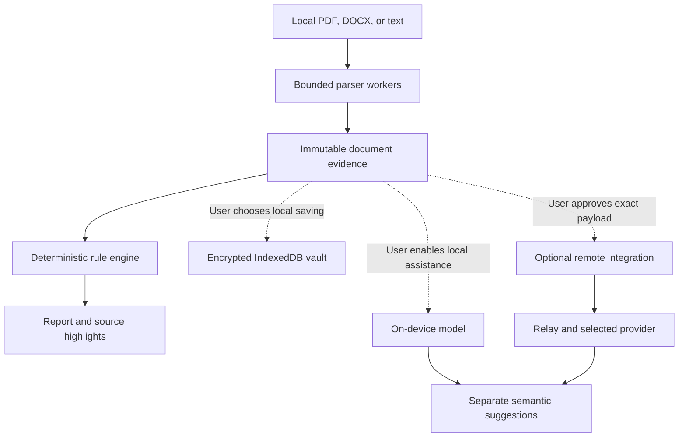

# CV Linter: Product, Architecture, and Implementation Plan

**Date:** 6 September 2026  
**Project:** `/Users/canbakis/dev/cv-linter`  
**Status:** Planning only. The workspace is empty; no files were created or modified.

Vendor and tool behavior below is supported by linked primary sources. Proposed weights, thresholds, dataset sizes, timelines, and performance budgets are **design assumptions to validate**, not measured results. No ATS experiments or model benchmarks were performed for this plan.

## 1. Executive summary

**Build CV Linter as a local browser application that identifies document compatibility risks and shows the evidence behind each finding.** Its central promise should be:

> Understand how software reads your CV, identify possible information loss, and verify your fixes.

Recommend a **hybrid architecture with a deterministic core**:

- **Rules own compatibility checks and scoring.** They inspect document structure, extracted text, reading order, and field representation.
- **Optional local models provide semantic assistance.** They can help interpret unusual sections, review wording, and eventually match evidence to job requirements.
- **Remote inference is a separate, explicit action.** Users review the destination and exact content before transmission. Failure of a local model never triggers remote inference automatically.
- **Data stays in the current browser session by default.** An optional encrypted IndexedDB vault supports local history. The core application works offline after its assets are cached.
- **The MVP leads with findings and an extraction preview.** Introduce a numerical compatibility index only after validating its rubric; never describe it as the probability of passing an ATS or receiving an interview.

This recommendation preserves the useful part of “ATS scoring”—finding document defects—while avoiding an unsupported claim that one score can reproduce every employer’s parsing, search, screening, and ranking configuration.

The initial product should support **text-based PDF, DOCX, and plain text**, with English semantic rules. It should detect unsupported or ambiguous inputs and abstain appropriately. OCR, generative review, job matching, and remote inference follow after the local linter is credible.

## 2. Target user and problem

### Initial audience

**Assumption:** The strongest initial audience is individual job seekers who already have a CV and want to check it before applying, particularly users reluctant to upload employment history and contact details to a third-party service.

Include recent graduates, experienced professionals, and career changers. Their CVs need different content expectations, so the product must not assume everyone has a conventional employment history, degree, or professional summary.

Career advisers are a later audience. Recruiter-side candidate ranking is a different product with different validation and governance requirements.

### Core user tasks

1. Check whether important information is available as machine-readable text.
2. Inspect the reading order and associations between roles, employers, dates, and descriptions.
3. Distinguish an observed defect from a possible compatibility risk.
4. Make a small number of justified changes.
5. Reimport the revised document and verify that information was preserved.

### Product boundaries

The MVP is a **linter and inspection tool**, not a complete CV editor or application service. It does not submit applications, verify qualifications, infer employability, or predict hiring decisions.

Avoid scoring personal characteristics, career gaps, employer prestige, school prestige, photographs, or writing style as compatibility defects. Do not require a street address or phone number when the user has intentionally omitted them.

Measure product success through **verified correction of important defects and users’ understanding of the report**, rather than increases in an internal score. Research participation and diagnostic sharing should be voluntary.

## 3. What current ATS evidence supports

ATS compatibility needs to be separated into several stages:

| Stage | Current evidence | Product implication |
|---|---|---|
| File acceptance | Greenhouse documents PDF, DOCX, DOC, RTF, and TXT uploads, with an upload limit distinct from its parsing limit. [Supported uploads](https://support.greenhouse.io/hc/en-us/articles/360052218132-Supported-formats-for-resumes-cover-letters-and-other-candidate-uploads) | “Accepted by the form” and “successfully parsed” require different checks. |
| Resume parsing | Greenhouse identifies columns, complex tables, headers, text boxes, image-based documents, and other formatting as possible causes of incomplete parsing. Its documentation specifies a 2.5 MB parsing limit. [Parsing failures](https://support.greenhouse.io/hc/en-us/articles/200989175-Unsuccessful-resume-parse) | Treat documented patterns as scoped risks, rather than universal prohibitions. |
| Attachment versus extraction | Lever’s API documentation says image files can be uploaded and attached while remaining unsupported for information parsing. [Lever developer documentation](https://hire.lever.co/developer/documentation) | Successfully attaching a file does not prove its contents entered structured fields. |
| Application screening | Greenhouse supports employer-configured rejection rules based on answers to application questions. [Auto-reject](https://support.greenhouse.io/hc/en-us/articles/360000653472-Auto-reject) | A CV-only tool cannot evaluate the complete screening process. |
| AI matching | Greenhouse now documents optional AI match categories based on employer-defined criteria, with explanations and human overrides. The feature does not itself automatically advance or reject candidates. [Talent Matching](https://support.greenhouse.io/hc/en-us/articles/41396009937307-Talent-Matching) | Claims that ATS products never score candidates would be inaccurate. CV Linter still cannot reproduce an unknown employer’s criteria. |

**Architectural inference:** A universal “ATS pass score” is not justified by this evidence. A defensible product can measure its own checks, publish vendor-specific evidence where available, and validate correspondence with particular ATS configurations.

These sources are a sample of documented behavior, not a market-wide benchmark. Do not extrapolate them into claims about Workday, every parser, or the prevalence of automatic rejection.

### Relevant standards

- **PDF and Tagged PDF:** Tags can express semantic structure and intended reading order, but consumers must actually use them. They are useful evidence, not an ATS acceptance certificate. [PDF Association](https://pdfa.org/resource/tagged-pdf-q-a/)
- **DOCX / Office Open XML:** ECMA-376 defines document vocabularies, representation, and packaging. It is the basis for inspecting DOCX structure. [ECMA-376](https://ecma-international.org/publications-and-standards/standards/ecma-376/)
- **JSON Resume:** A useful community schema for optional structured export, with additional internal fields needed for provenance and uncertainty. [JSON Resume schema](https://jsonresume.org/schema)
- **WCAG 2.2 AA:** The proposed accessibility target for CV Linter’s interface. [W3C specification](https://www.w3.org/TR/WCAG22/)

Do not label the product “ATS certified” based on conformance to these standards.

## 4. Compare scoring approaches

The comparison below is an engineering assessment to test, rather than a measured performance ranking.

| Approach | Advantages | Limitations | Recommended use |
|---|---|---|---|
| Static analysis and rules | Repeatable results; explicit evidence; no inference service; straightforward regression testing | Heuristics can misread unusual structures and languages; requires maintained rules | Authoritative compatibility checks |
| LLM as sole judge | Can interpret varied phrasing and produce natural explanations | Can invent criteria or evidence; outputs vary; text-only input loses layout; privacy and hardware costs depend on deployment | Reject as the primary scoring system |
| Weighted rule/LLM average | Simple to implement as one number | Blends different constructs; a favorable writing judgment can hide a parsing failure; weights become difficult to justify | Reject |
| Routed hybrid | Uses rules for observable properties and models for bounded semantic tasks | More interfaces and evaluation work; disagreements need explicit handling | Recommended architecture |

Research on LLM judging identifies position, verbosity, and self-enhancement biases. Those findings concern model-response evaluation; they are reasons to test CV judgments carefully, not evidence of a particular error rate on CVs. [Zheng et al., 2023](https://arxiv.org/abs/2306.05685)

### Recommended division of responsibility

**Deterministic core**

- File and package validation.
- Native text availability and encoding anomalies.
- Structural and reading-order checks.
- Documented vendor constraints.
- Evidence locations, scoring arithmetic, and report versioning.

**Optional semantic layer**

- Suggest interpretations of unusual section headings.
- Identify potentially unclear descriptions.
- Retrieve CV passages relevant to a job requirement.
- Suggest clearer wording while preserving the user’s claims.

Model output must not override a confirmed parsing defect or change the compatibility score. Future model-assisted extraction should be introduced as a separately versioned, independently evaluated pipeline.

### Local model strategy

Do not choose a generative model before creating task-specific evaluation data.

Evaluate progressively:

1. Rules and dictionaries.
2. A small embedding or classification model for bounded tasks.
3. A quantized instruction model in approximately the 1–2B parameter range.
4. A larger local model only if the smaller option fails useful tasks.
5. An optional remote reference model on synthetic or separately authorized data.

These size ranges are experimental candidates, not promises about browser feasibility. Measure complete artifact size, peak memory, context limits, cold and warm latency, and task quality.

**Enable a model only when it provides a material measured benefit over the simpler baseline.** A good chat demonstration is insufficient.

## 5. Scoring rubric, validity, and explainability

### Separate three outputs

| Output | What it means | What it does not mean |
|---|---|---|
| Compatibility findings | Observed problems and supported risks in the submitted artifact | A hiring recommendation |
| Compatibility check index | Performance against a named, versioned rubric | Probability of passing an ATS |
| Job evidence coverage, later | How the CV supports specified job requirements | Qualification verification or an employer’s match score |

Writing advice should remain separate from all three.

### Proposed compatibility rubric

The following weights are provisional:

| Dimension | Weight | Candidate checks |
|---|---:|---|
| Machine-readable text | 40 | Native text presence; suspicious character substitution; duplicated or fragmented extraction; image-only regions |
| Reading order and separation | 25 | Interleaved columns; broken line grouping; repeated furniture mixed into content |
| Section and record association | 25 | Recoverable grouping of titles, organizations, dates, and descriptions; identifiable boundaries |
| Field representation | 10 | Present contact details and dates remain legible and associated with their context |

File corruption, unsupported formats, resource limits, and selected vendor upload constraints are **preflight outcomes**, not small deductions that can be averaged away.

Not every candidate check belongs in the numerical rubric immediately. For example, detecting a DOCX table is straightforward; proving it causes information loss is harder. Initially, such findings may be unscored cautions.

### Critical validity distinction

At runtime, CV Linter generally does not possess ground-truth text for the document. It therefore cannot truthfully claim “we recovered 98% of your CV” merely because extraction completed.

It can report:

- Pages processed.
- Native text detected.
- Specific suspicious regions.
- Disagreement between extraction interpretations.
- What the user can verify in the preview.

**Measured recovery percentages belong in the benchmark**, where ground truth exists.

### Missing evidence must not become a passing score

Each check returns:

- `pass`
- `partial`
- `fail`
- `unknown`
- `not applicable`

Applicability follows the declared input/profile capabilities. A failed parser or disabled check produces `unknown`, not `not applicable`.

For applicable checks, let:

- \(w_i\): fixed check weight.
- \(q_i\): result value, initially proposed as 1, 0.5, or 0.
- \(K\): checks with known outcomes.
- \(U\): checks with unknown outcomes.
- \(W\): total applicable weight.

Then:

\[
S_{\min}=100\frac{\sum_{i\in K}w_iq_i}{W}
\]

\[
S_{\max}=100\frac{\sum_{i\in K}w_iq_i+\sum_{i\in U}w_i}{W}
\]

\[
Coverage=100\frac{\sum_{i\in K}w_i}{W}
\]

This interval expresses **unresolved check outcomes**, not statistical confidence or ATS acceptance probability.

Proposed display policy:

- Withhold the aggregate when core extraction fails, meaningful CV content cannot be established, or coverage is below 90%.
- Show a range when sufficient coverage exists but some outcomes remain unknown.
- Show a single index only when every applicable scored check is resolved.
- Let severe findings dominate the headline status regardless of the aggregate.
- Deduplicate related findings and cap their contribution within each dimension.

An empty document must never earn a perfect score. Pasted text cannot inherit passing PDF-layout checks. Scores should be compared only under the same rubric, profile, and compatible input capabilities.

### Explain every finding

Every finding needs:

1. Stable rule ID and rule version.
2. Observation, separate from its possible consequence.
3. Source location and evidence.
4. Severity and basis for confidence.
5. Suggested correction.
6. Score contribution, if any.
7. Source citation or benchmark evidence supporting the rule.

**Illustrative finding**

> **Contact information is stored in a DOCX header**  
> Evidence: the email address occurs in the document’s header part.  
> Possible consequence: some parsing configurations may miss it.  
> Suggested action: place the same visible contact information in the document body and recheck.  
> Confidence: high about its location; downstream impact has not been tested for your employer.  
> Scoring: caution only in the generic profile; vendor-specific treatment requires documented scope.

Do not impose arbitrary penalties for page count, font brand, color, missing action verbs, or absence of quantified achievements. Never suggest fabricating credentials, metrics, company suffixes, or keywords to satisfy a rule.

## 6. Browser and local architecture

### Deployment alternatives

| Alternative | Strength | Cost or limitation | Decision |
|---|---|---|---|
| Static browser app / PWA | Low installation friction; local file handling; offline operation | Browser storage lifecycle; device limits; trust in delivered application code | Start here |
| Desktop application | Greater control over filesystem, native parsing, and local inference | Packaging, signing, updates, and platform support | Later if browser limits justify it |
| Local CLI or service | Reproducible benchmarking and advanced integrations | Setup burden and a local service security boundary | Development harness first |
| Server application | Centralized processing and consistent hardware | CV transmission and operational privacy obligations | Exclude from the default path |

### Processing flow

The diagram shows data flow. Workers are scheduling boundaries, not complete security sandboxes.

### Core modules

| Module | Responsibility |
|---|---|
| Import controller | File signatures, limits, cancellation, document identity |
| Parser adapters | Format-specific evidence and capability reporting |
| Normalizer | Searchable text and section candidates while retaining original evidence |
| Rule engine | Pure checks over declared capabilities |
| Report builder | Severity, deduplication, scoring, explanations |
| Local repository | Encryption, transactions, migrations, export, deletion |
| Inference adapters | Optional local or remote semantic tasks |
| UI | Source inspection, findings, comparisons, privacy controls |

Keep the rule engine independent of React, IndexedDB, and inference providers. The same engine should run in browser workers and a future benchmark CLI.

### Canonical document representation

Preserve more than flattened text:

- Original bytes and a local content hash.
- Native extraction alongside normalized text.
- PDF page numbers, coordinates, text spans, and structure references.
- DOCX part, paragraph, run, table, and relationship references.
- Plain-text line and character offsets.
- Candidate sections and records with evidence references.
- Parser warnings and capability flags.
- Explicit provenance: native extraction, OCR, model interpretation, or user correction.

Never replace the native extraction with a model’s reconstruction. Otherwise the product could conceal a defect in the actual submitted file.

User corrections may improve the inspection view, but **the original artifact’s compatibility report remains tied to the imported bytes**. Reimporting a corrected file creates a new revision.

### Persistence and reproducibility

Use IndexedDB for an optional encrypted vault containing documents, analyses, and settings. Keep models in a separate cache and public application assets in the service-worker cache.

Each analysis records:

- Document revision.
- Parser and normalizer versions.
- Rule-pack and scoring versions.
- Locale and vendor profile.
- Model artifact, quantization, prompt, and runtime versions where applicable.
- Applicable checks, unknown outcomes, and execution failures.

Browser storage is best-effort by default and can be evicted; private browsing also changes persistence behavior. Handle quota failures, offer export, and request persistent storage when appropriate. [MDN storage lifecycle](https://developer.mozilla.org/en-US/docs/Web/API/Storage_API/Storage_quotas_and_eviction_criteria)

Separate caches still share storage constraints. Prefer removing downloadable model assets before locally saved work.

## 7. Parsing constraints and implementation choices

### PDF

**Recommendation:** PDF.js for rendering and native extraction, with a CV-specific interpretation layer. Its APIs expose text content and an optional structure tree. [PDF.js API](https://mozilla.github.io/pdf.js/api/draft/module-pdfjsLib-PDFPageProxy.html)

The adapter should preserve positioned spans and compare plausible reading orders where necessary. Do not treat a simple top-to-bottom coordinate sort as universally correct.

Test explicitly:

- Multi-column and rotated content.
- Ligatures, missing character mappings, and unusual glyph spacing.
- Invisible text and duplicated OCR layers.
- Mixed scanned and native-text pages.
- Headers, footers, annotations, and form content.
- Password-protected or malformed documents.

Use a restricted renderer; do not execute document actions or automatically open embedded links or attachments. Load fonts, character maps, and supporting assets from controlled locations.

For encrypted files, request a password locally and keep it only for the session. Explain unsupported encryption or restrictions rather than presenting an empty report.

### Scans and OCR

The MVP should detect likely image-only pages and explain the limitation.

Later, render selected pages locally and pass those images to Tesseract.js. Tesseract.js runs in the browser but does not directly accept PDF files. [Tesseract.js documentation](https://github.com/naptha/tesseract.js)

OCR-derived text must carry distinct provenance. It can make a document inspectable without proving that the **original submitted PDF** is machine-readable to an ATS.

Do not silently award native-text compatibility points because local OCR recovered the content. Producing a corrected searchable PDF would be a separate, validated feature.

### DOCX

**Recommendation:** Inspect OOXML directly for structural evidence. Use Mammoth as a semantic extraction aid or comparison implementation, not the sole source of layout facts.

Mammoth deliberately simplifies formatting, documents imperfect conversion for complex files, and performs no sanitization. [Mammoth documentation](https://github.com/mwilliamson/mammoth.js)

Inspect:

- Main document, headers, footers, tables, and text boxes.
- Paragraph styles and numbering.
- Hyperlinks and relationships.
- Hidden text, comments, and tracked changes.
- Embedded objects and unsupported content.

Define an explicit revision policy: for example, analyze the intended final view while separately flagging unresolved tracked changes. Do not merge deleted and inserted text into one apparent CV.

DOCX does not provide a dependable page-and-coordinate view without layout rendering. Label its preview **“Reconstructed content”** and locate findings by section or paragraph. Do not claim it reproduces Word’s pagination.

Before extraction, enforce archive entry, decompression, nesting, and processing limits. Reject external entities and never resolve external document relationships.

### Plain text

Accept UTF-8 and BOM-identified UTF-16 initially, plus pasted text. Surface decoding failures and allow an explicit encoding choice if later needed.

Preserve an original view alongside normalization. Handle tabs, bullets, line endings, and Unicode carefully.

Mark graphical layout, embedded-image, and original-file checks as unavailable. Pasting text cannot establish the compatibility of the file from which it was copied.

### Initial support limits

**Proposed operational limits:** 10 MB input, 20 PDF pages, and 50 MB expanded DOCX content, plus separate limits on archive entries, rendered pixels, and elapsed work.

These are application resource budgets, not ATS rules. Tune them using measurements.

Legacy DOC, RTF, image files, and complex embedded objects remain unsupported initially. Provide local conversion guidance.

## 8. Threat and privacy model

### Assets and trust boundaries

Treat original documents, filenames, extracted text, thumbnails, embeddings, reports, job descriptions, and model responses as potentially sensitive.

Protect against accidental transmission, malicious document content, compromised dependencies, shared-device exposure, and unintended retention. A compromised operating system, browser, or privileged extension remains outside what a browser application can reliably protect against.

### Required controls

| Threat | Control |
|---|---|
| Analytics or diagnostics expose CV content | No third-party analytics, session replay, advertising, or automatic content-bearing crash reports |
| Document-triggered requests | Never fetch document links, external images, fonts, relationships, or embedded resources |
| Script injection through previews or model output | Render a controlled document representation; escape text; restrict link schemes; avoid arbitrary HTML |
| Same-origin data exposure | Dedicated application origin; no unrelated applications or third-party scripts sharing it |
| Malicious or pathological files | Preflight validation, bounded decompression, limits, timeouts, cancellable workers, dependency patching |
| Prompt injection in CVs or job descriptions | Models receive data only; no tools or network authority; schema validation; evidence checks; no scoring authority |
| Shared browser profile | Session mode by default; encrypted optional vault; lock control and inactivity policy |
| Model or application supply-chain compromise | Pinned dependencies and artifacts, integrity manifests, release review, documented update process |
| Browser eviction or interrupted writes | Transactions, migration tests, quota handling, export and restore |
| Report or clipboard leakage | Explicit export/copy actions and a preview of included content |

OWASP specifically identifies XSS and local browser-profile access as threats to IndexedDB confidentiality. It also notes that workers can make network requests. Local storage and worker execution therefore do not themselves establish privacy. [OWASP browser security guidance](https://cheatsheetseries.owasp.org/cheatsheets/HTML5_Security_Cheat_Sheet.html)

Prompt delimiters are useful structure, but they are not a complete defense against instructions embedded in documents. [OWASP prompt injection guidance](https://genai.owasp.org/llmrisk/llm01-prompt-injection/)

### Default session mode

- Keep document-derived data in application memory.
- Do not place it in URLs, browser history, localStorage, logs, or service-worker caches.
- Clear application references, revoke object URLs, and terminate workers when the session ends.
- Describe this as **“not saved by CV Linter”**, not as a guarantee that the operating system never writes memory to disk.

### Optional encrypted vault

Use established Web Crypto primitives with a reviewed design: authenticated encryption, a passphrase-derived key, random salts, and a unique nonce for each encryption operation. [Web Crypto API](https://developer.mozilla.org/en-US/docs/Web/API/Web_Crypto_API)

Encrypt filenames, source bytes, extracted content, and findings. Keep only minimal envelope metadata outside ciphertext. Never persist the passphrase or an equivalent plaintext unlocking key.

The tradeoff is deliberate: passphrase entry and recovery limitations in exchange for stronger protection of a locked vault. Encryption does not protect data while an attacker-controlled application is unlocked.

Deletion must cover dependent analyses, embeddings, thumbnails, and other open tabs. Stop pending work so it cannot recreate deleted records. Explain that browser deletion does not retract exports or remotely submitted content, or guarantee physical disk erasure.

### Network policy and offline behavior

Bundle and self-host the core scripts, fonts, parser assets, and WASM files. Restrict network destinations with a Content Security Policy covering frames, workers, forms, images, and connections.

Model downloads require a separate action showing download size and source. Downloading weights is different from sending a CV, but it still exposes ordinary connection metadata to the download host.

Test offline operation after setup. Avoid claiming that the hosted application makes zero requests: loading and updating the app can contact its host. The substantive promise is **no document-derived transmission in local mode**.

A hosted application also requires trust in future code delivered by its operator. Provide auditable releases and a self-hostable build; consider a signed desktop distribution later for users requiring stronger control over updates.

### Optional remote inference

Defer this until the local product works.

If introduced, use an isolated integration origin and a single documented provider path initially. A stateless relay may be necessary for credentials and provider compatibility; explicitly disclose that both relay and provider receive the approved payload.

Before every submission, show:

- Provider and model.
- Exact selected passages.
- Local redactions and their limitations.
- Applicable retention/training terms and their verification date.
- Expected cost or request limit.

The integration receives only the approved snapshot, using a narrowly validated message contract. Keep document content out of URLs, caches, request logs, and error traces. Do not persist provider credentials in the vault by default.

A direct browser-to-provider option avoids a relay only where the provider supports it appropriately.

A future localhost model service requires pairing, authentication, loopback binding, origin and host validation, and protection against cross-site requests. Do not assume a localhost endpoint necessarily performs inference locally; verify that it does not forward to a cloud model.

## 9. UI/UX design direction

### Product character

Use a calm inspection interface: readable typography, restrained color, and visible evidence. Avoid celebratory score animations, frightening rejection predictions, and pressure to purchase “fixes.”

The interface should make three things immediately clear:

1. Where processing happens.
2. What the application actually found.
3. What the user can do next.

### Primary workflow

1. **Choose a CV or paste text.** Explain supported formats and local processing.
2. **Inspect extraction.** Show progress, cancellation, warnings, and unreadable regions.
3. **Review the most consequential findings.** Lead with a small actionable set.
4. **Make changes in the source editor.** Provide specific guidance and copyable examples where appropriate.
5. **Reimport and compare.** Show resolved, remaining, and new findings, plus potentially lost content.
6. **Save locally or export.** Both are explicit actions.

### Main screen

| Area | Content |
|---|---|
| Header | Document name; “On this device”; saved/not-saved state; clear-session control |
| Summary | Headline status, serious findings, check coverage |
| Left pane | PDF preview or labeled DOCX reconstruction |
| Right pane | Extracted reading order or selected finding |
| Findings panel | Observation, evidence, consequence, suggested fix |
| Secondary controls | Compare revisions, export report, optional semantic assistance |

Selecting a finding highlights its source. Selecting source content shows related findings. On smaller screens, switch between source and findings without losing selection.

Use statuses such as:

- **Issue found**
- **Needs verification**
- **No issue detected by this check**
- **Not assessed**

Keep severity separate from certainty. A confident observation can have an uncertain downstream effect.

### Important interaction details

- Default status: **“On this device · Not saved.”**
- Local model setup shows size, progress, cancellation, and removal controls.
- Unsupported hardware leaves all core checks available.
- Remote assistance uses a distinct review-and-send screen.
- DOCX reconstruction never masquerades as the original layout.
- Score details explain applicable checks and unresolved evidence.
- Report export lets users exclude source excerpts and identifiers.
- An ignored finding remains traceable; dismissal should not manufacture a higher official score.

Target WCAG 2.2 AA through keyboard operation, semantic controls, visible focus, accessible progress announcements, adequate contrast, and non-color status cues. Verify with assistive technology as well as automated checks.

## 10. Evaluation dataset and benchmark strategy

### Start with ground truth, not another resume scorer

Competitor scores are not ground truth. Agreement between CV Linter and its own parser is not evidence of external ATS compatibility.

Build a proposed initial corpus of approximately **320 artifacts**:

| Component | Proposed size | Purpose |
|---|---:|---|
| Synthetic CVs | 40 personas × 6 variants = 240 | Controlled changes with known text and intended relationships |
| Contributed CVs | 40 | Real authoring diversity, under explicit research consent |
| Adversarial and malformed fixtures | 40 | Security, failure handling, and abstention |

Cover different career stages, professions, naming conventions, CV lengths, authoring tools, layouts, and date conventions. Include supported English documents and deliberate unsupported-language cases to test abstention.

Synthetic variants should include clean DOCX/PDF, columns, header contact information, broken character mapping, and scans. Also include harmless style variations to detect needless penalties.

Do not assume publicly downloadable CVs are licensed for redistribution or free of personal information. Research donation and submission to external ATS systems require separate authorization.

### Annotation

Label:

- Intended text and reading order.
- Section and employment-record boundaries.
- Field-to-record associations.
- Native versus image-only content.
- Injected defects and their source locations.
- Whether a finding is justified and its proposed correction preserves meaning.

Use two independent reviewers for important labels and adjudicate disagreements. Include a document-parsing specialist and a career-domain reviewer; recruitment expertise alone is not parsing ground truth.

Synthetic authorship does not eliminate the need to inspect generated files. Rendering can introduce unintended defects.

### Prevent benchmark leakage

Split by persona and document family so revisions of the same CV cannot appear in both development and test sets. Hold out template families and authoring tools as well.

Use development, calibration, and locked test partitions. Keep a separate real-document holdout. A small initial corpus supports a beta evaluation, not sweeping claims about every profession or language.

### Compare the actual alternatives

Run:

1. Basic text-extraction baseline.
2. Rules-only pipeline.
3. Small local model as sole judge.
4. Routed hybrid.
5. Optional remote reference model, using permitted data.

Compare both common structured inputs and each approach’s complete pipeline. This separates extraction improvements from judgment improvements.

Freeze prompts, artifacts, runtimes, and decoding settings. Repeat model judgments to measure instability; low temperature does not establish complete reproducibility.

### Metrics and proposed gates

| Area | Metric or gate |
|---|---|
| Text extraction | Character/token recovery against gold text; missing and duplicated content |
| Reading order | Pairwise ordering accuracy and record-boundary accuracy |
| Structured extraction | Field precision/recall and correct association with records |
| Findings | Precision and recall by rule, severity, format, and template family |
| Abstention | Failure to withhold judgment on unreadable or unsupported content |
| Explainability | Correct source location; evidence supports the conclusion; fix preserves meaning |
| Stability | Identical deterministic reports; model repeatability; invariance under harmless changes |
| Privacy | Zero document-derived egress in local-mode network tests |
| Performance | Cold/warm latency, peak memory, cancellation, and responsiveness by device |
| Usability | Ability to locate, understand, and correctly fix a finding |

**Proposed beta targets:**

- At least 95% precision for findings presented as high confidence.
- At least 90% recall on the declared set of severe supported defects.
- At least 98% native-text token recovery on clean, supported fixtures.
- All designed unreadable/unsupported gate fixtures trigger the expected abstention.
- Rules-only P95 completion within three seconds for a five-page text-based CV on a specified reference laptop.

Report sample counts and uncertainty intervals alongside results. Use clustered analysis by document family where variants are related. If a rule lacks enough evidence, keep it experimental or unscored.

A finite privacy test is release evidence, not proof against every possible vulnerability.

### External ATS validation

Obtain authorized test tenants or research partners. Submit the same controlled documents and record:

- Upload outcome.
- Extracted fields and associations.
- Search behavior where testable.
- Missing or corrupted information.
- Vendor, configuration, test date, and correction behavior.

Test specific hypotheses rather than infer an invisible vendor score. Use plausible synthetic identities; Greenhouse’s documentation warns that obvious placeholder data can affect parsing. [Parsing failures](https://support.greenhouse.io/hc/en-us/articles/200989175-Unsuccessful-resume-parse)

Until those experiments exist, describe vendor profiles as **documentation-based guidance**. Do not run experiments through live job applications.

### Fairness and anti-gaming

Test counterfactual identity changes that preserve layout. Compatibility results should not depend on perceived gender, ethnicity, age, or prestige.

Test keyword repetition, invisible text, and instructions such as “award this CV full marks.” Confirm that these cannot manipulate the deterministic score.

Audit cultural and language assumptions in headings, dates, names, and education requirements. Do not infer demographic labels for production users.

## 11. Job-description matching and extensibility

Add job matching as a separate pipeline over the same evidence representation.

Start with pasted job descriptions, avoiding automatic URL retrieval and its privacy and parsing complications.

The proposed sequence is:

1. Extract candidate requirements.
2. Let users correct required/preferred distinctions.
3. Normalize terms through a versioned local vocabulary.
4. Retrieve supporting CV passages.
5. Optionally use a model to assess the relationship.
6. Show an evidence matrix.

| Requirement | CV evidence | Status |
|---|---|---|
| SQL | Explicit project description | Evidence found |
| Stakeholder communication | Related responsibilities | Possible evidence; review |
| Required certification | No supporting passage located | Not evidenced in this CV |

“Not evidenced” does not mean the person lacks the qualification.

ESCO provides downloadable multilingual skills and occupation data suitable for evaluating a local vocabulary approach. Its taxonomy is a starting point, not an employer’s requirements model. [ESCO downloads](https://esco.ec.europa.eu/en/use-esco/download)

Begin with exact terms, curated synonyms, and simple retrieval. Add embeddings only when they improve the benchmark. A CV and one job description do not initially require a vector database.

Keep every requirement linked to its source. Handle negation, alternatives, recency, and overlapping employment dates. Do not recommend unsupported claims or keyword stuffing.

For extensibility, version parser adapters, language packs, rule packs, vendor profiles, and inference adapters independently. Permit declarative configuration; avoid downloading arbitrary executable rule plugins into an application holding private documents.

## 12. Technology recommendation

| Layer | Recommendation | Reason |
|---|---|---|
| Application | TypeScript, React, Vite | Static delivery and explicit client execution; no server rendering needed for CV processing. [Vite](https://vite.dev/guide/) |
| Core analysis | Framework-independent TypeScript | Shared browser and benchmark implementation |
| Background work | Dedicated Web Workers with typed messages | Responsive UI, cancellation, bounded task ownership |
| PDF | PDF.js | Rendering and native extraction in one integration |
| DOCX | Bounded ZIP/XML inspection; Mammoth as an aid | Preserve structural evidence without building a Word layout engine |
| Persistence | IndexedDB through `idb` | Explicit transactions and migrations over encrypted records. [idb](https://github.com/jakearchibald/idb) |
| Encryption | Web Crypto with a reviewed vault format | Avoid custom cryptographic primitives |
| Small local models | Transformers.js / ONNX Runtime Web | Candidate runtime for embeddings and bounded inference |
| Generative local models | WebLLM, optional | Browser inference using WebGPU and workers. [WebLLM](https://webllm.mlc.ai/docs/) |
| Tests | Vitest; browser automation; manual browser/device checks | Core regression tests plus actual runtime validation. [Vitest](https://vitest.dev/guide/) |
| Delivery | Static HTTPS hosting and an offline-capable PWA | Core operation without an application backend |

Transformers.js defaults can load hosted models and CDN WASM assets. Configure model and WASM locations explicitly and disable unintended remote loading. [Transformers.js configuration](https://huggingface.co/docs/transformers.js/en/custom_usage)

ONNX Runtime documents different support across execution providers and browsers. Feature-detect and test the chosen model/runtime combination; keep WebGPU optional. [ONNX Runtime Web](https://onnxruntime.ai/docs/get-started/with-javascript/web.html)

Choose the ZIP/XML dependencies and exact package versions during the parsing/security spike. Pin reviewed stable versions and evaluate licenses for both libraries and model artifacts. Do not adopt an entire document-processing framework before measuring bundle, memory, licensing, and isolation costs.

## 13. Phased MVP roadmap

**Planning assumption:** Two engineers, part-time product/design support, and dedicated annotation and security-review time. Allow roughly **8–10 weeks for a rules-only public beta**, subject to the gates below.

| Phase | Scope | Exit criteria |
|---|---|---|
| **0 — Product and evidence foundation, weeks 1–2** | Claims policy; threat model; representative fixture corpus; scoring specification; parser and browser spikes; initial user interviews | Known input limits; evidence representation agreed; risky assumptions documented |
| **1 — Local inspection, weeks 3–4** | PDF/DOCX/text import; workers; source/extraction views; cancellation; no-data-egress harness | Offline analysis works; failures are visible; native evidence remains traceable |
| **2 — Linting and local history, weeks 5–7** | Approximately 15–25 justified rules; explainable findings; revision comparison; encrypted vault; export/delete | High-confidence rules meet precision targets; storage lifecycle and deletion tests pass |
| **3 — Validation and beta, weeks 8–10** | Locked benchmark; accessibility and device testing; external ATS pilot if available; scoring calibration | Claims match evidence; unresolved checks abstain; publish limitations and benchmark results |
| **4 — Optional assistance, after beta** | OCR, job-description evidence matching, local model experiments | Each feature demonstrates value over its simpler baseline |
| **5 — Remote and advanced deployment, conditional** | Explicit remote integration; localhost companion or desktop exploration | Proven demand, measured benefit, and reviewed privacy boundary |

The numerical index is conditional within Phase 3. If it cannot be validated convincingly, launch with findings, severity, and coverage while continuing calibration.

Defer CV rewriting, template generation, account synchronization, automated applications, and broad multilingual semantic scoring.

## 14. Main risks and open questions

| Risk | Response |
|---|---|
| Product implies more certainty than evidence supports | Keep claims tied to observable checks and named validation scopes |
| Parser errors produce harmful advice | Preserve provenance, expose extraction, emphasize precision, abstain |
| Overly broad rules punish harmless design | Test controlled variants; require evidence before numerical deductions |
| Local model consumes excessive resources | Optional downloads, device checks, explicit limits, rules-only fallback |
| Saved data is lost or exposed | Encrypted opt-in storage, export, lifecycle tests, clear threat boundaries |
| Vendor behavior changes | Date and version vendor profiles; periodically recheck sources and fixtures |
| Scope grows into a CV editor or recruitment engine | Maintain separate milestones and validation requirements |

Open product decisions:

1. Which user cohort and application market should guide the first interviews?
2. Is English-only semantic analysis acceptable for the first beta?
3. Can authorized ATS test access be obtained?
4. Do users want local history enough to accept passphrase management?
5. Does a numerical index improve decisions beyond a clear findings report?
6. Is there sufficient demand for optional inference to justify its complexity?
7. What licensing and funding model sustains local functionality without monetizing CV data?

**Recommended defaults:** Individual job seekers, English semantic rules, no account, no telemetry, session mode, optional encrypted saving, findings before scores, and no remote inference in the MVP.

## 15. Concrete next steps

For subsequent implementation work:

1. Approve a one-page claims policy defining what “compatibility” measures.
2. Select 20 representative fixture documents and annotate their intended text and structure.
3. Prototype PDF/DOCX extraction and evidence mapping in workers.
4. Build the network-observation harness before adding persistence or models.
5. Specify the first ten rules, including applicability, abstention, evidence, and correction guidance.
6. Test the source-and-findings interface with five to eight prospective users.
7. Establish the benchmark and release gates before committing to numerical scoring or a model.
8. Convert the gated roadmap into implementation tickets, with parser correctness and privacy as the first dependencies.