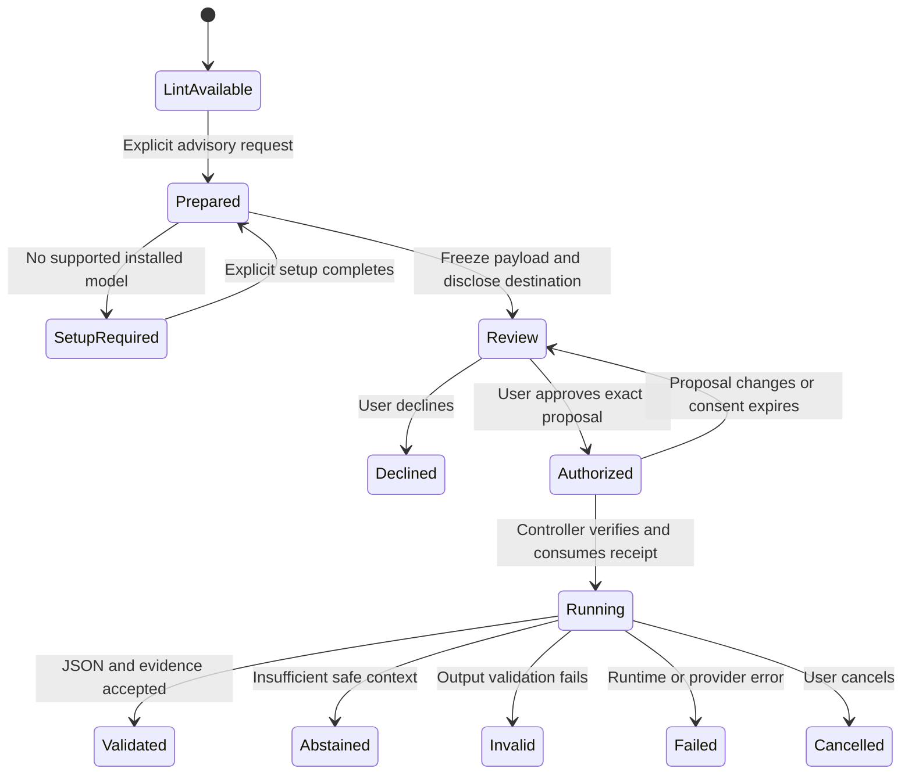

# CV Linter: Agent and PWA UX Design

**Date:** 6 September 2026
**Status:** Proposed interaction specification; no UI implementation, usability results or model-quality claims.
**Related:** [Product plan and claims policy](architecture-and-product-plan.md) · [Commands, evidence, consent and schemas](agent-skill-architecture.md)

## 1. Product experience and claims policy

The primary workflow is a distributable Agent Skill; the PWA offers drag-and-drop access and visual inspection of the same analysis. Users should understand what was checked, where data was processed, what evidence supports a finding, and which action is available next. Avoid score celebrations, rejection predictions and pressure to buy fixes.

Use the product plan's [claims policy](architecture-and-product-plan.md#1-product-decision-and-claims-policy) in every surface, report and export:

| Content | Presentation |
|---|---|
| Deterministic observation | Rule name/ID, observed property, source evidence, severity, certainty and check scope |
| Vendor fact | Named vendor, exact documented workflow/edition, primary source and source-review status |
| Design inference | Label “Possible consequence” or “Documentation-based guidance”; distinguish observed layout from untested downstream effect |
| Advisory model judgment | Persistent “LLM advisory” label, criterion, evidence, model/location, uncertainty and audit link |
| Unvalidated assumption | Mark the feature/profile/model “Experimental” or the quantity “Proposed target”; never present it as measured |
| Unknown/unassessed | Explain missing input, capability or context; do not render a pass indicator |

The [ATS research](research/ats-vendor-research.json), [distribution research](research/agent-skill-distribution-research.json) and [judge research](research/llm-judge-research.json) supply the research basis. The layouts and interaction choices here are design proposals to test. All examples below are illustrative, with no empirical scores or pass rates.

Judge support is visible from the first release. **Check CV** always means deterministic lint; **Request advisory review** is a separate first-class action. “Supported,” “model installed,” “validated for this task,” “requested,” and “completed” are different states. Do not label judging globally disabled merely because the user has not requested it. No action called Check, Compare to job, Refresh report or Export may silently invoke a model.

## 2. Shared information model and vocabulary

Both agent and PWA views render the same versioned reports. Keep these result groups visually and semantically distinct:

1. **Document checks:** native text, structure, field associations, scoped vendor risks and unresolved checks.
2. **Job evidence:** literal/curated-vocabulary matches and assessed requirement scope from deterministic comparison.
3. **Advisory review:** explicit judge interpretations, wording suggestions, semantic mappings and abstentions.
4. **Run details:** source revision, parser/rule/profile versions, permissions/disclosures, model execution and audit record.

Use these labels consistently:

| UI label | Meaning |
|---|---|
| Issue found | A check observed a defined defect; its consequences still have a stated scope |
| Needs verification | A risk, ambiguous extraction or uncertain interpretation requires inspection |
| No issue detected by this check | A resolved check did not detect its target defect; not a universal ATS pass |
| Not assessed | Unknown outcome or unavailable context/capability; explain why |
| Supported / Contradicted | Advisory label relative to a named criterion and cited evidence; not verified qualification |
| Not evidenced in assessed content | Complete declared evidence scope lacked support; not proof that the person lacks it |
| Abstained | The judge could not responsibly assess the criterion; show the reason |

Map deterministic `partial` to Needs verification and `unknown` to Not assessed; display `not_applicable` with its distinct reason in check details. Severity and certainty are separate. A DOCX header location can be certain while its effect in a particular ATS is unknown. Low-confidence model output must abstain; high model confidence is not a calibrated probability.

Headline status prioritizes consequential deterministic findings and unresolved extraction. No green “ATS ready” badge. An empty/unreadable file cannot earn a perfect score, and a favorable judge opinion cannot reduce a deterministic warning. A compatibility index remains conditional on validated rubric policy; any displayed interval describes unresolved checks, not acceptance probability. Job-evidence coverage and writing advice do not blend into that index.

## 3. Agent UX

### Discovery, input and routing

The skill description advertises local lint, evidence reports and explicit advisory review. Host-native invocation may differ; document the tested syntax for each released adapter. Hermes, Claude Code and Codex support their own skill invocation/packaging and permissions, so exact UX is a compatibility test rather than a universal command promise. [Hermes skills](https://hermes-agent.nousresearch.com/docs/user-guide/features/skills), [Claude skills](https://docs.anthropic.com/en/docs/claude-code/skills), [Codex skills](https://developers.openai.com/codex/skills).

| User intent | Agent behavior |
|---|---|
| “Check my CV at this path” | Resolve only that selected input and call `lint`; preserve all findings and unknowns |
| “Check my CV,” with no selected input | Ask for one file/path or explicit content; do not search Downloads, the repository or the home directory |
| “Compare this CV to this job description” | Call deterministic `compare-to-job`; show exact versus curated-synonym evidence and reviewable requirements |
| “Review how clearly this experience supports the job” | Prepare `judge` for specified criteria; show model/payload disclosure and use valid consent before running |
| “Show the report” | Render existing results using `report`; no new inference or reparsing |
| “Check the revised file” | Explicit new lint run and compatible deterministic revision diff; previous advisory output is marked as belonging to the old revision |

Never substitute the conversational host's opinion for executable output. The host can explain a disclosed result without becoming the CV Linter judge; new substantive model assessments must use the explicit audited judge path. Requests for wholesale rewriting or applicant ranking are outside this workflow; offer evidence-grounded review within scope without editing the source automatically.

### Host disclosure before content reaches chat

Before reading/returning private evidence, establish where the executable and host conversational model run and what the host receives. Show separate states such as **Analysis: this device** and **Conversation: remote provider / unknown**. A cloud-hosted executable is remote processing even when its command is named local. Do not claim the whole workflow is local based on stdio or a loopback endpoint.

Default cloud/unknown-host tool results contain an opaque local report handle and generic operational status. They contain no CV text, hashes, filenames, findings counts or document-derived summaries. Private evidence remains in the local viewer. A trusted local review surface lets the user approve an exact projection into the host context; that consent is separate from remote judging. A shortened summary still requires disclosure because it derives from the CV.

Illustrative response before private output disclosure:

> The local operation finished. Open the local report to inspect the findings. Sharing findings in this conversation requires selecting what this host may receive.

The adapter must not then read the report with a general file tool to evade the projection gate. If the host cannot support this boundary, offer the standalone executable/PWA. If the user pasted the CV into cloud chat already, explain that it has already entered that host's context; do not describe a subsequent local lint as undoing that transmission. Host transcript retention/deletion is separate from CV Linter storage.

### Compact evidence-based response

After the user authorizes a detailed projection, provide a short report with processing location, scope/version, most consequential findings, explicit unknowns, and local evidence links. Do not dump an entire CV or raw audit log into the conversation. Paginate through approved evidence only; label truncated views and give access to the complete local report.

Illustrative disclosed finding:

> **Needs verification — contact information in a DOCX header.** The parser located the selected contact span in the header part. Greenhouse documents this as a parsing risk; the effect in your employer's configuration is untested. Inspect the highlighted paragraph, and consider placing the same visible information in the document body before rechecking.

Link the cited vendor guidance near the finding. [Greenhouse parse failures](https://support.greenhouse.io/hc/en-us/articles/200989175-Unsuccessful-resume-parse). This example is an observed-location claim plus a scoped inference, not a rejection prediction.

Useful next actions are Open evidence, Compare to job, Request advisory review, Compare revisions and Export. Offering an action does not execute it. If lint fails, name the limitation and preserve partial evidence with unknown outcomes; do not invent a polished completion summary.

### Agent judge interaction

1. Resolve the requested task/criteria and verified evidence snapshot. Preparation is local and does not call a model.
2. Show the trusted local proposal: model/location, selected content, omitted/redacted content, scope, attempts/budget and retention. If no model is installed, show **Judge supported · Model setup required** with a separate setup action.
3. Use an existing valid receipt for this exact operation or obtain the user's decision on the reviewed proposal. Never accept a model-written approval flag or infer remote consent from provider credentials.
4. Execute through the dedicated tool/command. Announce progress and offer cancellation without streaming unvalidated model text as findings.
5. Present validated advice separately from lint, with per-criterion evidence and an audit link. Display abstention, invalid output, error and cancellation as actual outcomes.

Avoid repeated approval for an unchanged, already authorized proposal. A changed CV/JD, scope, redaction, model/destination, prompt/rubric or attempt budget requires a new proposal. Headless agent workflows need exact preauthorized proposals, not a general “yes to everything.” No provider fallback after timeout or refusal.

## 4. PWA UX and layout

### Entry and local state

The PWA offers **Choose CV**, drag-and-drop, Paste text and **Import report**. Explain supported formats and declared limits before processing. Treat file selection as permission to lint that input locally, not to save it, download a model or send it remotely. Default label for browser-only local analysis: **On this device · Not saved by CV Linter**. Report imports show original execution location and imported provenance rather than inheriting this label for past runs.

A PWA can cache application assets for offline operation, while filesystem integration varies by browser. File handlers are not a universal assumption. [Installability](https://developer.mozilla.org/en-US/docs/Web/Progressive_web_apps/Guides/Making_PWAs_installable), [offline behavior](https://developer.mozilla.org/en-US/docs/Web/Progressive_web_apps/Guides/Offline_and_background_operation), [File System API](https://developer.mozilla.org/en-US/docs/Web/API/File_System_API), [file association](https://developer.mozilla.org/en-US/docs/Web/Progressive_web_apps/How_to/Associate_files_with_your_PWA). Installation/update or model download may contact a host; local document analysis must not transmit document-derived data.

Use browser-compatible shared core modules and schemas. Initial agent-to-PWA handoff is an explicit local report export/import, without content in a URL or hidden localhost connection. Browsers cannot directly speak stdio. Any later paired native bridge has a separate connection/forwarding disclosure. Until a supported browser judge adapter or paired runtime exists, let the PWA inspect native judge reports and show local setup/handoff guidance; do not replace it with unannounced remote inference.

### Desktop report layout

```text
Document revision     Analysis location     Saved state     Clear session
Scope: input type · language · selected profile · source status
Summary: consequential findings · unresolved checks · assessed scope

┌─────────────────────────────┬────────────────────────────────────┐
│ Source / Extracted order    │ Document checks | Job evidence     │
│                             │ Advisory review | Run details      │
│ PDF page highlights, or    │                                    │
│ DOCX reconstructed content │ Selected finding / criterion        │
│                             │ Observation and possible effect    │
│ Original vs normalized     │ Evidence · confidence · source     │
│ provenance controls        │ Suggested action and limitations   │
└─────────────────────────────┴────────────────────────────────────┘
Compare to job   Request advisory review   Compare revisions   Export
```

On narrow screens switch between source and findings while retaining selection and scroll position. Keep action labels visible without relying on icons. Background processing reports phases, cancellation and resource errors; do not show invented progress percentages when total work is unknown.

PDF highlights show page number and positioned text. DOCX explicitly says **Reconstructed content** and uses part/paragraph locations, without invented Word pagination. Plain text keeps original and normalized views with line/offset navigation. OCR, user corrections and model interpretations have separate provenance markers. Recovering scanned text locally does not change the original PDF's native-text status.

### Evidence interaction

Selecting a finding highlights its exact span and shows surrounding context. Selecting a source span lists related checks and advisory criteria. Keyboard users can move from the finding to evidence and back; screen readers receive a text location as well as a visual highlight.

The detail card includes observation, severity, confidence basis, rule/version, evidence quote/location, possible consequence, suggested correction, source citation and any score contribution. Never suppress a deterministic failure because the user dismissed advice. Dismissals are annotations and do not recompute an official rubric as if a check passed.

For judge evidence, show **Sent to judge** beside the selected original view. Make redaction boundaries, omitted passages, scope limits and extraction uncertainty visible. Quotes must resolve to the transmitted snapshot and map back to surviving original spans. If evidence cannot be verified, mark the output invalid and show the validation error; do not use a plausible-looking quote as a finding.

### Vendor and job context

Default profile is Generic. Selecting a vendor shows documentation scope/status; selecting an exact API/edition or adding employer requirements is a separate contextual choice. No vendor-logo “certified” treatment. The profile drawer distinguishes upload, parsing, structured fields, search and employer screening.

Examples of correct profile copy: Greenhouse upload and parse budgets differ; SmartRecruiters' 2 MB rule belongs to the documented application API; Taleo's 100 KB parsing guidance needs historical edition/workflow confirmation. Workday and iCIMS do not acquire universal format/score rules from choosing their names. Ashby general image/file uploads do not establish resume image parsing; Lever resume-only search differs from broader profile search. Link the [vendor fact table and source-status notes](architecture-and-product-plan.md#3-ats-evidence-and-vendor-specific-implications) rather than implying these behaviors were tested by CV Linter.

Job comparison accepts an explicitly supplied local file or pasted JD, with no automatic URL retrieval. Display the requirement inventory for required/preferred/alternative/negated wording review. Show a matrix of requirement excerpt, CV evidence, deterministic match method, assessment scope and uncertainty. “Not evidenced” means only that this assessed CV lacks located support. Semantic interpretation is a distinct Request advisory review action over selected criteria, with exact requirement spans included.

## 5. Consent flows

Consent belongs to the reviewed action, not a general feature toggle. The controller owns receipts and validation; UI controls display and request authority without bypassing it.

| Action | Required disclosure / user action |
|---|---|
| Select file for local lint | Selected input and local scope; selection authorizes analysis only |
| Download a model | Source/license, size, digest verification, destination/cache and network download metadata; explicit download |
| Local judge | Selected installed model/artifact/runtime, verified local/non-forwarding status, exact evidence/task, redaction, attempts/limits and local retention; explicit run request/consent |
| Configure remote provider | Endpoint/model choices, credentials location and known retention/training terms; enable provider only, no CV transmission |
| Remote judge | Exact payload/fields and destination including relay, model/version, redaction limitations, retention terms/date or unknowns, cost estimate or cap; **Send and judge** |
| Share result with agent host | Host location/provider/retention if known and exact selected report projection; separate confirmation from judge-provider consent |
| Save/export/copy | Destination and included identifiers, source excerpts and audit fields; explicit action |

Do not preselect remote mode or combine “download local model” with “upload my CV.” Local remains preferred when installed and validated for the requested task. A network-local/self-hosted server is off-device; a localhost service with unknown forwarding is not labeled verified local. Unknown terms and forwarding status remain visible, not replaced with privacy assurances.

The review screen contains a readable payload preview, selected criteria, redaction diff and excluded-scope notice, plus technical details on demand. Model/provider and execution location are always visible because they affect the decision. Avoid putting cryptographic hashes in the primary user flow; offer them in Run details. A change to the payload or model returns the flow to review and invalidates prior consent.



Deterministic lint results remain available in every judge state. Completed responses may contain mixed advisory labels, including criterion-level abstention. Do not convert Invalid/Failed/Cancelled into “no issues found.” A retry is explicit and limited by the approved attempt budget; changing context or requesting a different provider requires new consent. Cancellation prevents further work but cannot retrieve content already sent. Do not claim deletion from a remote provider unless a verified provider mechanism actually confirms it.

For one exact local run already requested after disclosure, avoid a redundant confirmation. For a remote run, both provider opt-in and payload approval must be established. Saved provider selection, prior-session consent or generic host tool approval is insufficient. Noninteractive use surfaces `consent_required` with a local review handle rather than waiting indefinitely or approving automatically.

## 6. Advisory result and auditability

Each advisory criterion shows its label, exact CV/JD evidence, concise rationale, missing evidence and any source-preserving suggestion. Display **Advisory · Does not change document checks** with model/location. Do not merge model confidence and deterministic check certainty. Suggestions offer Copy suggestion or Mark reviewed; they do not edit the CV, add unsupported achievements or auto-apply changes.

For disagreement, show both the deterministic observation and the separate advisory interpretation. For example, semantic wording support does not resolve text lost in extraction. If the judge is low-confidence, cannot see necessary context, or flips under a consented repeated review, show abstention/instability rather than an averaged verdict. Pairwise review is limited to two revisions of the user's own CV; there is no applicant leaderboard or hiring recommendation.

The Run details/audit drawer is reachable from every advisory result and failure. It shows:

- **Inputs and scope:** revision identifiers/hashes, selected CV/JD spans, excluded content, redaction policy, provenance, retrieval coverage and any truncation.
- **Model execution:** provider, endpoint/relay, local/remote/forwarding status, model artifact/snapshot, quantization, runtime, prompt/rubric/schema versions, decoding parameters and criterion/order seed when applicable.
- **Authorization:** approving action/channel, timestamp, payload binding, expiry, allowed attempts/cost, whether consent was consumed; opaque receipt reference without exposing bearer credentials.
- **Outcome:** validation status, accepted/abstained criteria, evidence errors, start/finish/cancel/error events and actual token/resource/cost data when available.
- **Reproduction and retention:** parser/rules/profile/package versions, input/payload/output/event hashes, storage policy, audit completeness, export choices and replay limitations.

Use plain explanations beside technical values: a hash ties this run to exact content but cannot recover deleted content; fixed model settings may still yield different results; self-reported confidence is not measured accuracy. Do not display hidden chain-of-thought. An invalid reply is not accepted advice; raw rejected content is not automatically retained or shown.

Keep an append-only event sequence during the retained run, including refusals, invalid replies and errors. Show incomplete audit recovery visibly; never mark a partially recorded provider request as an auditable success. Hash chaining gives limited tamper evidence relative to a trusted checkpoint, not proof against replacement by the device owner. Offer a minimal audit receipt export by default and an explicit encrypted evidence bundle when the user wants replayable material. Session-only audits disappear when cleared unless exported; the label must not promise permanent history.

## 7. Revisions, persistence and failure states

### Revision comparison and export

Reimporting a modified file produces a new input hash and analysis. Show resolved, remaining and new findings plus potential content losses under a compatible rubric/profile/capability set. If versions differ, offer an explicit rerun under a selected common version or show separate reports with comparison withheld. Do not apply old advice or consent to a new revision. A fresh advisory comparison is a separate explicit operation.

Report export preview offers summary, selected evidence, full local evidence bundle and audit receipt choices. Default shared exports omit unnecessary identity/source excerpts and warn about any still-included document-derived findings. Generate inert self-contained HTML or versioned JSON without external resources. Imported reports are untrusted data; label original execution provenance and verification status. Hashes printed inside an import do not authenticate it, and imports never auto-run tools, fetch source files or execute scripts.

### Saving and deletion

Default PWA mode keeps CV Linter data in session memory. “Not saved by CV Linter” does not promise the OS never writes memory to disk. Optional encrypted local history has a passphrase/lock flow, recovery limitations, retention controls and export. Browser storage can be evicted; offer recovery guidance after quota/migration failure. [Storage lifecycle](https://developer.mozilla.org/en-US/docs/Web/API/Storage_API/Storage_quotas_and_eviction_criteria).

Clear session, delete saved run/history and remove downloaded models are distinct actions. Stop in-flight work and remove dependent analyses, previews, embeddings, advice and audit material to prevent regeneration after deletion. Explain that exports, host transcripts and provider copies have separate retention and cannot be retracted by clearing this app. Do not request accounts or research donation during basic checking.

### Required failure presentations

| Condition | User-visible response and next action |
|---|---|
| No readable text / scan | Not assessed for native text-dependent checks; show detected regions and supported local conversion/OCR options without inventing recovered text |
| Unsupported/encrypted/malformed file | Explain support/password/resource limitation; local password entry only if supported; retain no password |
| Permission or integrity failure | Name the denied input/output or invalid package without private-path leakage; no broader directory scan or automatic reinstall |
| Missing/unsupported model or hardware | Judge supported; setup/task availability required; lint remains complete |
| Invalid JSON or unverifiable evidence | Advisory output rejected; show concise validator reason and audit outcome; no silent repair |
| Low confidence, conflicting evidence or suspicious instructions | Abstained; show assessed scope and reason; user can inspect source or prepare narrower criteria |
| Expired/replayed/changed consent | Review required; no execution; changed payload is visible |
| Remote timeout/cancel | Show whether transmission started and what is known; no automatic retry/provider switch |
| PWA cannot reach native stdio runtime | Offer report import/local executable handoff or a supported browser model; no implicit localhost connection |
| Storage quota/eviction or incomplete audit | State what was retained; offer explicit export/recovery; do not claim saved/auditable success |

## 8. Accessibility and UX validation

Target [WCAG 2.2 AA](https://www.w3.org/TR/WCAG22/). Provide keyboard-complete source/evidence navigation, semantic headings/tables, visible focus, non-color statuses, contrast, responsive reflow and readable error messages. Announce phase changes and completion without noisy token streaming. Move focus predictably after consent dialogs and preserve the selected finding after cancellation. Source highlights need textual locations; consent payloads and audit details must be readable with assistive technology. Test actual browsers/devices and screen readers, not automated checks alone.

Proposed usability tasks: install/invoke the skill, select only the intended file, distinguish a vendor fact from a possible consequence, locate and fix an evidence-backed issue, interpret a missing-evidence/abstention result, understand host versus judge disclosure, decline/cancel remote review, inspect the sent payload and audit, compare revisions, and export/delete locally. Measure task completion, corrections made without content loss, understanding, accidental disclosure attempts, time/steps and abandonment. Sample size and target thresholds are planning assumptions to set before the study; no study has run.

Use the [agent benchmark](architecture-and-product-plan.md#10-evaluation-dataset-and-benchmark-strategy) to test explicit/implicit routing, unsupported hosts, cloud-context projection, narrow filesystem access, consent replay, model failure, deterministic cross-client parity, report imports, and audit completeness. Test that all critical consent screens expose actual location/scope and that no visual score or language implies hiring success. Model bias/position-bias/entailment tests remain separate evaluation work; a pleasing interface does not validate the judge.
