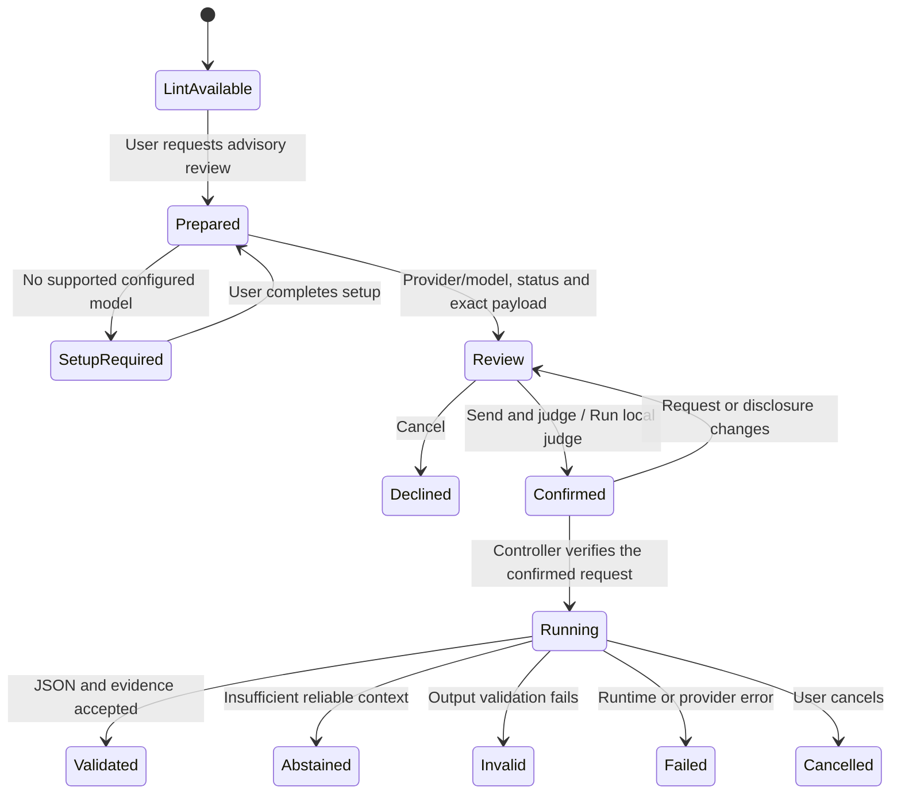

# CV Linter: Agent and PWA UX Design

**Date:** 8 September 2026
**Status:** Proposed interaction specification; no UI implementation, usability results or model-quality claims.
**Related:** [Product plan and claims policy](architecture-and-product-plan.md) · [Commands, evidence, confirmation and schemas](agent-skill-architecture.md)

## 1. Product experience and claims policy

The primary workflow is an Agent Skill invoking the bundled local executable; the PWA offers drag-and-drop access and visual inspection of the same analysis. **Choose CV → local findings → optional judge review and confirmation → separate advice.** MCP is optional and deferred beyond MVP; users do not configure a server to check a CV. Lead with useful findings and evidence, without score celebrations, rejection predictions or pressure to buy fixes.

Deterministic linting is local by default and needs no privacy setup. If the user selects an LLM judge, show a concise disclosure that selected content goes to the chosen provider/model, label **ZDR / non-ZDR / unknown**, show the exact payload and require confirmation. Encryption, retention management, cryptographic receipts, host projection and detailed threat modeling stay out of the normal UX; proportionate implementation safeguards remain in the [architecture](architecture-and-product-plan.md#8-data-handling-and-practical-safeguards).

Use the product plan's [claims policy](architecture-and-product-plan.md#1-product-decision-and-claims-policy) in every surface, report and export:

| Content | Presentation |
|---|---|
| Deterministic observation | Rule name/ID, observed property, source evidence, severity, certainty and check scope |
| Vendor fact | Named vendor, exact documented workflow/edition, primary source and source-review status |
| Authorized vendor observation | “Observed in an authorized vendor test,” with the tested workflow, date and fixture scope; only display publishable reviewed results, without implying vendor endorsement |
| Design inference | Label “Possible consequence” or “Design inference”; distinguish observed layout from untested downstream effect |
| Advisory model judgment | Persistent “LLM advisory” label, criterion, evidence, model/location, uncertainty and Run details link |
| Unvalidated assumption | Mark the feature/profile/model “Experimental” or the quantity “Proposed target”; never present it as measured |
| Unknown/unassessed | Explain missing input, capability or context; do not render a pass indicator |

The [ATS research](research/ats-vendor-research.json), [vendor evidence and testing plan](research/vendor-evidence-and-testing-plan.md), [distribution research](research/agent-skill-distribution-research.json) and [judge research](research/llm-judge-research.json) supply the research basis. Candidate-facing best-practice blogs supply hypotheses, not authority for compatibility requirements. The layouts and interaction choices here are design proposals to test. All examples below are illustrative, with no empirical scores or pass rates.

Judge support is visible from the first release. **Check CV** always means deterministic lint; **Request advisory review** is a separate first-class action. “Supported,” “model installed,” “validated for this task,” “requested,” and “completed” are different states. Do not label judging globally disabled merely because the user has not requested it. No action called Check, Compare to job, Refresh report or Export may silently invoke a model.

## 2. Shared information model and vocabulary

Both agent and PWA views render the same versioned reports. Keep these result groups visually and semantically distinct:

1. **Document checks:** native text, structure, field associations, scoped vendor risks and unresolved checks.
2. **Job evidence:** literal/curated-vocabulary matches and assessed requirement scope from deterministic comparison.
3. **Advisory review:** explicit judge interpretations, wording suggestions, semantic mappings and abstentions.
4. **Run details:** source revision, parser/rule/profile versions, model/provider, reviewed ZDR metadata, confirmation and outcome; secondary details rather than a required workflow.

Use these labels consistently:

| UI label | Meaning |
|---|---|
| Issue found | A check observed a defined defect; its consequences still have a stated scope |
| Needs verification | A risk, ambiguous extraction or uncertain interpretation requires inspection |
| No issue detected by this check | A resolved check did not detect its target defect; not a universal ATS pass |
| Not assessed | Unknown outcome or unavailable context/capability; explain why |
| Supported / Contradicted | Advisory label relative to a named criterion and cited evidence; not verified qualification |
| Not evidenced in assessed content | Complete declared evidence scope lacked support; not proof that the person lacks it |
| Abstained | The judge could not responsibly assess the criterion; show the reason |

Map deterministic `partial` to Needs verification and `unknown` to Not assessed; display `not_applicable` with its distinct reason in check details. Severity and certainty are separate. A DOCX header location can be certain while its effect in a particular ATS is unknown. Low-confidence model output must abstain; high model confidence is not a calibrated probability.

Headline status prioritizes consequential deterministic findings and unresolved extraction. No green “ATS ready” badge. An empty/unreadable file cannot earn a perfect score, and a favorable judge opinion cannot reduce a deterministic warning. A compatibility index remains conditional on validated rubric policy; any displayed interval describes unresolved checks, not acceptance probability. Job-evidence coverage and writing advice do not blend into that index.

## 3. Agent UX

### Discovery, input and routing

The skill description advertises local lint, evidence reports and explicit advisory review. Host-native invocation may differ; document the tested syntax for each released adapter. Hermes, Claude Code and Codex support their own skill invocation/packaging and permissions, so exact UX is a compatibility test rather than a universal command promise. [Hermes skills](https://hermes-agent.nousresearch.com/docs/user-guide/features/skills), [Claude skills](https://docs.anthropic.com/en/docs/claude-code/skills), [Codex skills](https://developers.openai.com/codex/skills).

| User intent | Agent behavior |
|---|---|
| “Check my CV at this path” | Resolve only that selected input and call `lint`; preserve all findings and unknowns |
| “Check my CV,” with no selected input | Ask for one file/path or explicit content; do not search Downloads, the repository or the home directory |
| “Compare this CV to this job description” | Call deterministic `compare-to-job`; show exact versus curated-synonym evidence and reviewable requirements |
| “Review how clearly this experience supports the job” | Prepare `judge` for specified criteria; show provider/model, ZDR status and exact payload; require confirmation before running |
| “Show the report” | Render existing results using `report`; no new inference or reparsing |
| “Check the revised file” | Explicit new lint run and compatible deterministic revision diff; previous advisory output is marked as belonging to the old revision |

Never substitute the conversational host's opinion for executable output. The host can explain a disclosed result without becoming the CV Linter judge; new substantive model assessments must use the explicit judge review and confirmation path. Requests for wholesale rewriting or applicant ranking are outside this workflow; offer evidence-grounded review within scope without editing the source automatically.

### Brief host context note

Explain once in adapter setup/help: **“CV checks run in the local executable. Findings shared in this chat are handled under your agent host's data policies.”** Do not claim the whole conversation is local. If the executable actually runs in a remote agent runtime, label that location and offer standalone CLI/PWA for on-device analysis. A CV pasted into chat is already part of that host's context.

Return useful, compact findings with necessary evidence; a separate per-result host projection preview or receipt is not part of MVP. Avoid dumping the full CV, exact judge payload or raw model replies into chat by default. Offer Open local report for full inspection, and respect stricter user/host settings. The optional judge provider is a separate recipient and always needs its own payload review and confirmation. If a host cannot run the executable or support judge confirmation, offer the standalone flow; MCP setup is a later integration option.

### Compact evidence-based response

After lint completes, provide a short report with the most consequential findings, explicit unknowns and local evidence links. Use a small processing-location label; keep full version details in the report. Label truncated views and offer the complete local report. No extra privacy confirmation is required to see normal lint findings.

Illustrative finding:

> **Needs verification — contact information in a DOCX header.** The parser located the selected contact span in the header part. Greenhouse documents this as a parsing risk; the effect in your employer's configuration is untested. Inspect the highlighted paragraph, and consider placing the same visible information in the document body before rechecking.

Link the cited vendor guidance near the finding. [Greenhouse parse failures](https://support.greenhouse.io/hc/en-us/articles/200989175-Unsuccessful-resume-parse). This example is an observed-location claim plus a scoped inference, not a rejection prediction.

Useful next actions are Open evidence, Compare to job, Request advisory review, Compare revisions and Export. Offering an action does not execute it. If lint fails, name the limitation and preserve partial evidence with unknown outcomes; do not invent a polished completion summary.

### Agent judge interaction

1. Resolve the requested task/criteria and evidence snapshot locally. Choosing an LLM judge starts review; it does not call the model.
2. Show provider/model, execution location, **ZDR / non-ZDR / unknown**, selected content and the exact payload in a trusted review surface. If no model is configured, offer model/provider setup, then return to review.
3. Require **Send and judge**, or **Run local judge** for on-device inference. A tested host user-input channel can capture this decision; an agent-written approval flag or automated click cannot. Use interactive CLI review if the host cannot provide it.
4. Run the prepared request, with progress and cancellation. Show advice only after output and evidence validation.
5. Present criterion-level advice separately from lint, with evidence and Run details. Abstention, invalid output, error and cancellation remain explicit outcomes.

Use one review/confirmation step, without receipt handling or a separate privacy opt-in wizard. Do not ask again for an unchanged, already confirmed operation. A changed CV/JD, scope, payload, provider/model/route, policy disclosure or limits returns to review. Headless execution without a confirmed active proposal returns `confirmation_required`; there is no blanket future approval or automatic provider fallback.

## 4. PWA UX and layout

### Entry and local state

The PWA offers **Choose CV**, drag-and-drop, Paste text and **Import report**. Explain supported formats and declared limits before processing. Treat file selection as permission to lint that input locally, not to save it, download a model or send it remotely. Default label for browser-only analysis: **Linted locally**. Explain session-only storage in help and near Export/Clear session, not a setup wizard. Report imports show original execution location and imported provenance rather than inheriting this label for past runs.

A PWA can cache application assets for offline operation, while filesystem integration varies by browser. File handlers are not a universal assumption. [Installability](https://developer.mozilla.org/en-US/docs/Web/Progressive_web_apps/Guides/Making_PWAs_installable), [offline behavior](https://developer.mozilla.org/en-US/docs/Web/Progressive_web_apps/Guides/Offline_and_background_operation), [File System API](https://developer.mozilla.org/en-US/docs/Web/API/File_System_API), [file association](https://developer.mozilla.org/en-US/docs/Web/Progressive_web_apps/How_to/Associate_files_with_your_PWA). Installation/update or model download may contact a host; local document analysis must not transmit document-derived data.

Use browser-compatible shared core modules and schemas. Initial agent-to-PWA handoff is explicit local report export/import, with no content in URLs or hidden localhost connection. The PWA does not need MCP and cannot directly speak native stdio. Until a supported browser judge adapter exists, Request advisory review provides handoff to the executable, and the PWA imports its advice. A paired native bridge is deferred; do not introduce a hidden proxy or remote fallback to make judging appear available in the browser.

### Desktop report layout

```text
Document revision     Linted locally     Export     Clear session
Scope: input type · language · selected profile
Summary: consequential findings · unresolved checks · assessed scope

┌─────────────────────────────┬────────────────────────────────────┐
│ Source / Extracted order    │ Document checks | Job evidence     │
│                             │ Advisory review | Run details      │
│ PDF page highlights, or    │                                    │
│ DOCX reconstructed content │ Selected finding / criterion        │
│                             │ Observation and possible effect    │
│ Original vs normalized     │ Evidence · confidence · source     │
│ provenance controls        │ Suggested action and limitations   │
└─────────────────────────────┴────────────────────────────────────┘
Compare to job   Request advisory review   Compare revisions   Export
```

On narrow screens switch between source and findings while retaining selection and scroll position. Keep action labels visible without relying on icons. Background processing reports phases, cancellation and resource errors; do not show invented progress percentages when total work is unknown.

PDF highlights show page number and positioned text. DOCX explicitly says **Reconstructed content** and uses part/paragraph locations, without invented Word pagination. Plain text keeps original and normalized views with line/offset navigation. OCR, user corrections and model interpretations have separate provenance markers. Recovering scanned text locally does not change the original PDF's native-text status.

### Evidence interaction

Selecting a finding highlights its exact span and shows surrounding context. Selecting a source span lists related checks and advisory criteria. Keyboard users can move from the finding to evidence and back; screen readers receive a text location as well as a visual highlight.

The detail card includes observation, severity, confidence basis, rule/version, evidence quote/location, possible consequence, suggested correction, source citation and any score contribution. Never suppress a deterministic failure because the user dismissed advice. Dismissals are annotations and do not recompute an official rubric as if a check passed.

For judge evidence, show **Sent to judge** beside the selected original view. Make redaction boundaries, omitted passages, scope limits and extraction uncertainty visible. Quotes must resolve to the transmitted snapshot and map back to surviving original spans. If evidence cannot be verified, mark the output invalid and show the validation error; do not use a plausible-looking quote as a finding.

### Vendor and job context

Default profile is Generic. Selecting a vendor shows documentation scope/status; selecting an exact API/edition or adding employer requirements is a separate contextual choice. No vendor-logo “certified” treatment. The profile drawer distinguishes upload, parsing, structured fields, search and employer screening.

Keep **Documented vendor guidance**, **Observed by CV Linter**, and any future **Observed in an authorized vendor test** distinct. Show claim scope, source verification/date, evidence origin, and local/vendor benchmark coverage in details; vendor findings must be permitted for publication. A sandbox or API access badge cannot stand in for a tested claim. Selecting Teamtailor, Greenhouse, Lever, or Workable never uploads the user's CV or requires vendor credentials. All profiles are documentation-based at this planning stage.

Examples of correct profile copy: Greenhouse upload and parse budgets differ; SmartRecruiters' 2 MB rule belongs to the documented application API; Taleo's 100 KB parsing guidance needs historical edition/workflow confirmation. Workday and iCIMS do not acquire universal format/score rules from choosing their names. Ashby general image/file uploads do not establish resume image parsing; Lever resume-only search differs from broader profile search. Link the [vendor fact table and source-status notes](architecture-and-product-plan.md#3-ats-evidence-and-vendor-specific-implications) rather than implying these behaviors were tested by CV Linter.

For Teamtailor, distinguish local hidden-text observations from its documented Co-pilot warnings; avoid implying intent or an automatic score penalty. For Workable, “CV Linter could not extract native text” must not become “Workable cannot parse this CV,” given its documented image-based parsing. Preserve pending-source labels on inherited Lever help-page claims.

Job comparison accepts an explicitly supplied local file or pasted JD, with no automatic URL retrieval. Display the requirement inventory for required/preferred/alternative/negated wording review. Show a matrix of requirement excerpt, CV evidence, deterministic match method, assessment scope and uncertainty. “Not evidenced” means only that this assessed CV lacks located support. Semantic interpretation is a distinct Request advisory review action over selected criteria, with exact requirement spans included.

## 5. Judge disclosure and confirmation

The only extra review step in the normal checking workflow appears when the user requests a judge. The controller prepares the request locally; the UI displays it and captures a real user confirmation before execution. Choosing a provider, having credentials or previously judging a different CV is insufficient.

Illustrative remote review card; bracketed values are populated from the prepared request:

```text
Review with [provider] / [model]
Selected CV content will be sent to [provider] using [model].
[Also sending selected job-description content, when applicable.]
[Via gateway name, if any.]
ZDR status: unknown          Policy details

Review: [selected task and sections]     [Cost estimate or request cap]
Selected content: [readable exact passages, with exclusions marked]
Exact payload: [scrollable complete request body, expandable full view]

Cancel                       Send and judge
```

The status field always shows **ZDR**, **non-ZDR** or **unknown** for a provider request; do not hide it under Policy details. The exact-payload view is available before confirmation and includes every submitted CV/JD passage, instruction, rubric, report field, attachment/metadata if any, and generation parameter. Show the complete request representation alongside readable content; do not substitute a summary or silently truncate the available full view. Destination and any relay are named; authentication secrets are never displayed. Any edit rebuilds the actual prepared payload and resets confirmation. Exclude unnecessary contact/identity content when the task permits, but do not claim redaction makes a CV anonymous.

For fully on-device, non-forwarding inference, replace the disclosure with **“Runs on this device using [model]; no provider transmission”** and the button with **Run local judge**. Keep the exact input preview and confirmation. Provider-policy ZDR does not apply to this route; do not label a local runtime ZDR. A loopback service with unknown forwarding is not presented as verified on-device inference.

### What the ZDR label means

ZDR is provider-policy metadata for this account, model, endpoint, feature set and route, **not a guarantee** of deletion, confidentiality or no training. The [architecture's labeling policy](architecture-and-product-plan.md#zdr-is-provider-policy-metadata-not-a-guarantee) requires verified applicable evidence and a verification date for ZDR/non-ZDR; missing, stale or uncertain evidence shows unknown. A provider saying it offers ZDR does not establish that this user's request has it. Policy details show source/contract reference, scope, last verification date and material caveats, without a retention-management workflow.

Non-ZDR and unknown choices remain usable after the same disclosure and confirmation. No prechecked consent, ZDR-only default restriction, green safety certification, or promise that CV Linter can delete provider copies. If a relay receives content, include its policy when determining the displayed status. Use words as well as color.



Lint results remain available in every state. Invalid, Failed and Cancelled never mean “no issues found.” MVP makes one attempt by default; offer an explicit Retry after showing the outcome and whether data may already have been sent. A changed request requires a fresh preview/confirmation. Cancellation prevents further work but cannot recall a submitted request. Do not silently retry, repair with another model call, or switch providers.

Model download is a separate setup action showing source, size, license and progress/cancel. No model downloads occur during lint. Export and Clear session remain ordinary explicit controls; neither requires a privacy wizard. Noninteractive judge calls without a trusted confirmation return `confirmation_required` and instructions to open review; no signed receipts or headless batch approval flow is exposed in MVP.

## 6. Advisory results and Run details

Each criterion shows its label, exact CV/JD evidence, concise rationale, missing evidence and any source-preserving suggestion. Display **Advisory · Does not change document checks** with the model/provider. Copy suggestion and Mark reviewed do not edit the CV or add unsupported achievements. Model confidence and deterministic observation certainty remain separate.

If advice conflicts with lint, show both with their evidence; semantic wording support cannot resolve text lost during extraction. Missing context, low confidence or instability yields abstention. Editorial comparisons are limited to revisions of the user's own CV, with no applicant leaderboard or hiring recommendation.

A secondary **Run details** drawer provides the selected scope and sent payload, model/provider/route, reviewed ZDR status with source/date, request confirmation time, component versions, validation/outcome and actual usage/cost when known. Keep hashes, runtime settings and reproduction limits in technical details. Raw rejected replies and hidden chain-of-thought are not normal report content; show a concise validation error instead.

These are ordinary run records for explanation and troubleshooting, not cryptographic receipts or proof of provider deletion. They last for the active session unless the user exports a report. The normal flow needs no audit-chain viewer, encrypted evidence bundle or retention controls.

## 7. Revisions, persistence and failure states

### Revision comparison and export

Reimporting a modified file produces a new input hash and analysis. Show resolved, remaining and new findings plus potential content losses under a compatible rubric/profile/capability set. If versions differ, offer an explicit rerun under a selected common version or show separate reports with comparison withheld. Do not apply old advice or confirmation to a new revision. A fresh advisory comparison is a separate explicit operation.

Report export offers Summary or Report with selected evidence, with a preview of included content. Include basic Run details when exporting advice; full source/payload inclusion is an explicit export choice. Default shared exports omit unnecessary identity/source excerpts. Generate inert self-contained HTML or versioned JSON without external resources. Imported reports are untrusted data; label original execution provenance and verification status. Hashes printed inside an import do not authenticate it, and imports never auto-run tools, fetch source files or execute scripts.

### Session and export

MVP keeps document-derived state in session memory or private temporary files for the active operation; explicit CLI/PWA exports save only to the chosen destination. Provide **Export** and **Clear session**. Clearing stops in-flight work and removes current analyses, previews and advice, with best-effort temporary-file cleanup. Explain in help that clearing cannot retract exported files, host transcripts or provider copies; avoid claims of secure erasure from the OS.

Saved history, encrypted vaults, passphrase recovery, retention schedules and account synchronization are deferred. They should be added only if a demonstrated user need warrants the extra workflow, with appropriate implementation safeguards. Basic checking does not ask for an account or research donation.

### Required failure presentations

| Condition | User-visible response and next action |
|---|---|
| No readable text / scan | Not assessed for native text-dependent checks; show detected regions and supported local conversion/OCR options without inventing recovered text |
| Unsupported/encrypted/malformed file | Explain support/password/resource limitation; local password entry only if supported; retain no password |
| Permission or integrity failure | Name the denied input/output or invalid package without private-path leakage; no broader directory scan or automatic reinstall |
| Missing/unsupported model or hardware | Judge supported; setup/task availability required; lint remains complete |
| Invalid JSON or unverifiable evidence | Advisory output rejected; show concise validator reason and run outcome; no silent repair |
| Low confidence, conflicting evidence or suspicious instructions | Abstained; show assessed scope and reason; user can inspect source or prepare narrower criteria |
| Expired/changed confirmation or duplicate run request | Return to review when confirmation is stale; show existing state for duplicates without sending twice |
| Remote timeout/cancel | Show whether transmission started and what is known; no automatic retry/provider switch |
| Judge runtime unavailable from PWA | Offer executable handoff and report import; no MCP setup, hidden proxy or implicit localhost connection |
| Export or run-record failure | State what was saved and whether inference may have occurred; preserve available results in session and offer retrying export |
| Provider-policy evidence missing or stale | Show ZDR status unknown with the reason in Policy details; allow explicit confirmation without a guarantee |

## 8. Accessibility and UX validation

Target [WCAG 2.2 AA](https://www.w3.org/TR/WCAG22/). Provide keyboard-complete source/evidence navigation, semantic headings/tables, visible focus, non-color statuses, contrast, responsive reflow and readable error messages. Announce phase changes and completion without noisy token streaming. Move focus predictably after review dialogs and preserve the selected finding after cancellation. Source highlights need textual locations; payload previews and Run details must be readable with assistive technology. Test actual browsers/devices and screen readers, not automated checks alone.

Proposed usability tasks: install/invoke the skill, select only the intended file, distinguish a vendor fact from a possible consequence, locate and fix an evidence-backed issue, interpret a missing-evidence/abstention result, identify the selected provider/model and ZDR status, inspect the exact payload, decline/confirm/cancel judging, compare revisions, and export/clear the session. Check that the brief host-context note is understood without blocking the basic workflow. Measure task completion, corrections made without content loss, understanding, accidental disclosure attempts, time/steps and abandonment. Sample size and target thresholds are planning assumptions to set before the study; no study has run.

Use the [agent benchmark](architecture-and-product-plan.md#10-evaluation-dataset-and-benchmark-strategy) to test routing through the executable, unsupported hosts, compact results, narrow filesystem access, changed/missing confirmation, duplicate sends, model failure, cross-client parity and report imports. Verify that previewed payloads match actual requests and that all three ZDR states, policy changes, local inference and relay/unknown routes are presented accurately. Test basic lint completion without privacy dialogs or MCP setup, and confirm no visual score or language implies hiring success. Model bias/position-bias/entailment tests remain separate evaluation work; a pleasing interface does not validate the judge.
